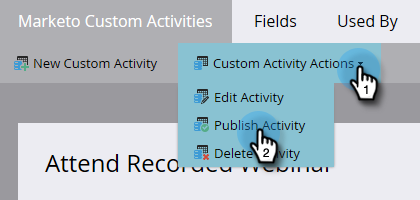

# Publish a Custom Activity {#publish-a-custom-activity}

Learn how to publish your custom activity.

1. Go to the **[!UICONTROL Admin]** area.

   

1. Click **[!UICONTROL Marketo Custom Activities]**.

   

1. Select the custom activity you want to publish.

   

1. Click the **[!UICONTROL Custom Activity Actions]** drop-down and select **[!UICONTROL Publish Activity]**.

   

   The custom activity's [!UICONTROL State] changes from [!UICONTROL Draft]...

   

   ...to [!UICONTROL Published].

   
