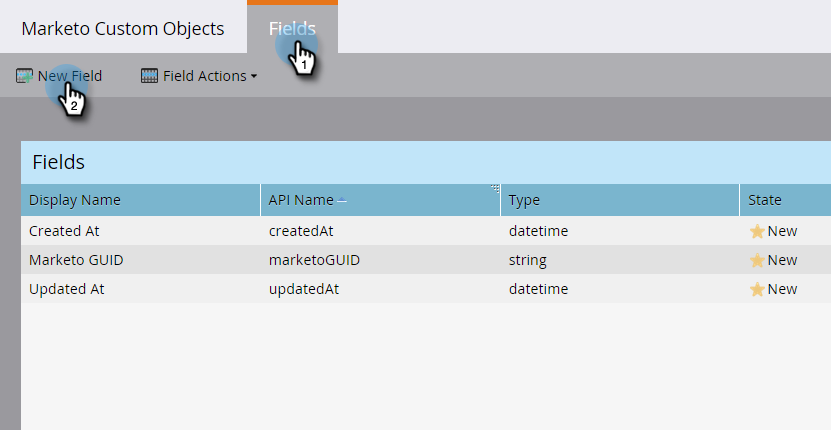
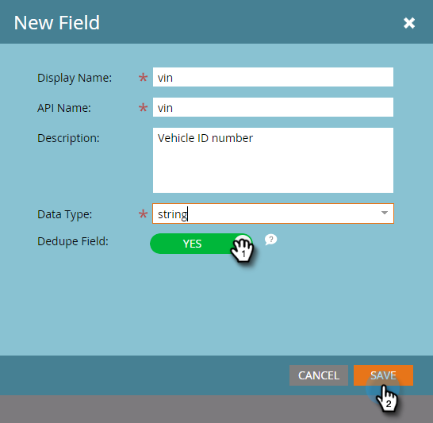

# Add Marketo Custom Object Fields {#add-marketo-custom-object-fields}

After you've created a custom object, you need to add fields to it to meet your business needs.

Fields define the specific information used by a custom object. Link fields have a special job, to connect custom objects, and are covered in a [separate article](add-marketo-custom-object-link-fields.md).

1. Click **Admin**, and in **Database Management**, select **Marketo Custom Objects**.

   

1. Select the object you want to add the field to on the right.

   

1. In the **Fields **tab, click **New Field**.

   

   >[!NOTE]
   >
   >The three fields shown above are created automatically by Marketo when you create a custom object. Marketo manages these fields automatically and you can't edit or delete them.

1. Enter a display name and description.

   

   >[!NOTE]
   >
   >The API name can be edited only until it's approved.

1. Now, choose an appropriate data type from the list.

   

1. Pull the Dedupe slider over if you want to use the new field as a unique identifier. Click **Save **to finish.

   

   >[!TIP]
   >
   >When you create a dedupe field, you can use it to remove duplicate fields in your database.

1. Add any other fields you need.

   >[!NOTE]
   >
   >**Reminder**
   >
   >
   >If you're building a one-to-many structure, you need to add a Link field to your custom object. For a many-to-many structure, you don't need a link field in the custom object, but you must add two link fields in the intermediary object. See [Add Marketo Custom Object Link Fields](add-marketo-custom-object-link-fields.md) to create the link fields, and [Understanding Marketo Custom Objects](understanding-marketo-custom-objects.md) for more information about types of custom objects.

>[!MORELIKETHIS]
>
>* [Add Marketo Custom Object Link Fields](add-marketo-custom-object-link-fields.md)
>* [Edit and Delete a Marketo Custom Object](edit-and-delete-a-marketo-custom-object.md)
>* [Understanding Marketo Custom Objects](understanding-marketo-custom-objects.md)
>* [Edit and Delete Marketo Custom Object Fields](edit-and-delete-marketo-custom-object-fields.md)
>

