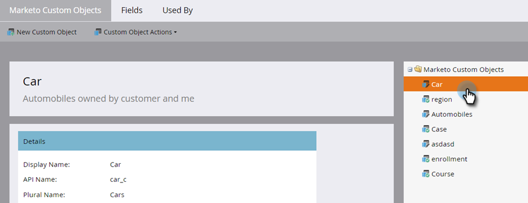
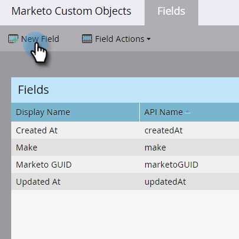
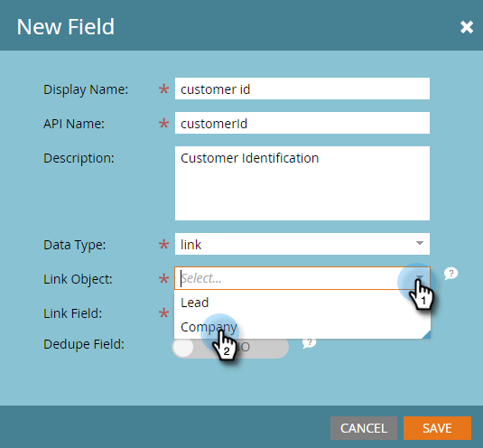
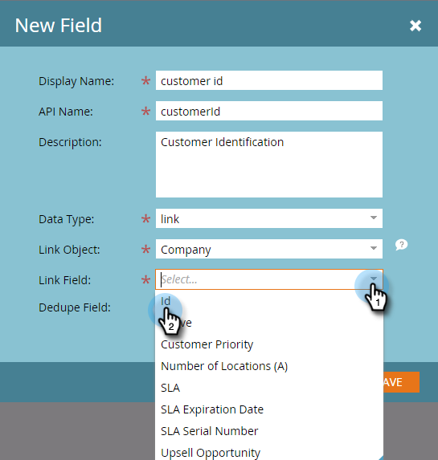
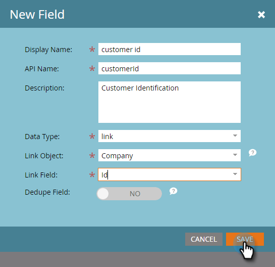
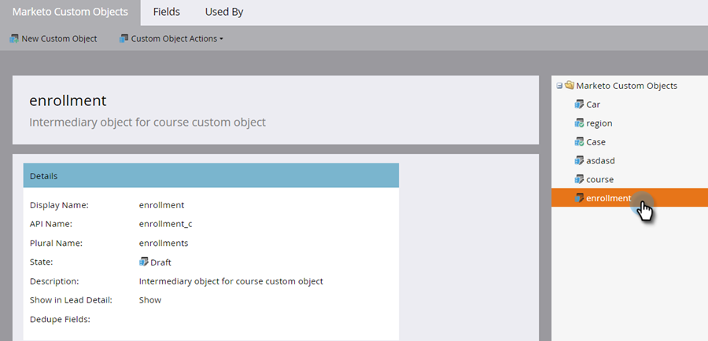
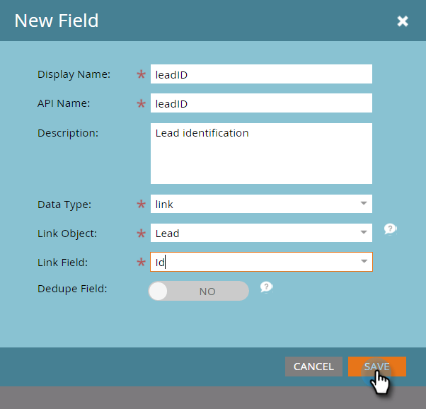
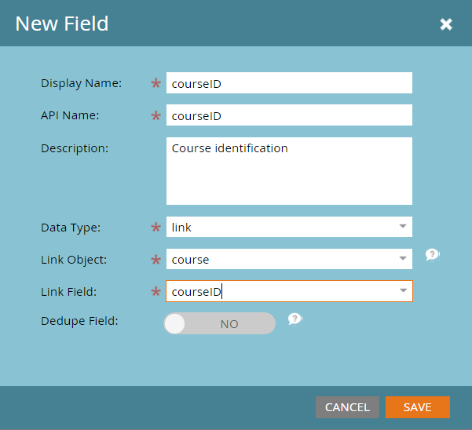
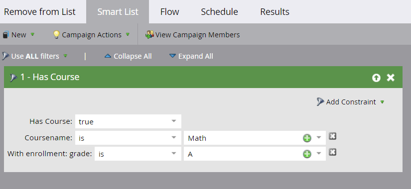

# Add Marketo Custom Object Link Fields {#add-marketo-custom-object-link-fields}

When you create custom objects, you must provide link fields to connect the custom object record to the correct parent record.

* For a one-to-many custom structure, use the link field in the custom object to connect it to a person or a company.
* For a many-to-many structure, you use two link fields, connected from a separately created intermediary object (which is a type of custom object, too). One link connects to people or companies in your database and the other connects to the custom object. In this case, the link field is not located in the custom object itself.

## Create a Link Field for a One-to-Many Structure {#create-a-link-field-for-a-one-to-many-structure}

Here's how to create a link field in a custom object for a one-to-many structure.

1. Go to the **[!UICONTROL Admin]** area.

   

1. Click **Marketo Custom Objects**.

   

1. Select the custom object in the list.

   

1. In the **[!UICONTROL Fields]** tab, click **[!UICONTROL New Field]**.

   

1. Name the link field and add an optional [!UICONTROL Description]. Be sure to select the **[!UICONTROL Link]** **[!UICONTROL Data Type]**.

   

   >[!CAUTION]
   >
   >You won't be able to go back and create, edit, or delete a [!UICONTROL Link] or [!UICONTROL Dedupe Field] once the custom object is approved.

1. Select whether the **[!UICONTROL Link Object]** is for a **[!UICONTROL Lead]** (person) or a **[!UICONTROL Company]**.

   

   >[!NOTE]
   >
   >If you choose [!UICONTROL Lead], you'll see Id, email Address, and any custom fields in the list.
   >
   >If you choose [!UICONTROL Company], you'll see Id and any custom fields in the list.

1. Select the **[!UICONTROL Link Field]** you want to connect to as the parent of the new field.

   

   >[!NOTE]
   >
   >Only string field types are supported in the [!UICONTROL Link Field].

1. Click **[!UICONTROL Save].**

   

## Create a Link Field for a Many-to-Many Structure {#create-a-link-field-for-a-many-to-many-structure}

Here's how to create a link field in an intermediary object for use in a many-to-many structure.

>[!PREREQUISITES]
>
>You must have already created the intermediary object and any custom objects you intend to link it to.

1. Go to the **[!UICONTROL Admin]** area.

   

1. Click **[!UICONTROL Marketo Custom Objects]**.

   

1. Select the intermediary object you want to add the field to.

   

1. In the **[!UICONTROL Fields]** tab, click **[!UICONTROL New Field]**.

   

1. You need to create two link fields. Create them one at a time. First, name the field for the members of your database list (leadID, for example). Add an optional [!UICONTROL Description]. Be sure to select the **[!UICONTROL Link]** **[!UICONTROL Data Type]**.

   

   >[!CAUTION]
   >
   >You won't be able to go back and create, edit, or delete a [!UICONTROL Link] or [!UICONTROL Dedupe Field] once the custom object is approved.

1. Select the **[!UICONTROL Link Object]** from your database, in this case **[!UICONTROL Lead]**.

   

1. Select the **[!UICONTROL Link Field]** you want to connect to, in this case, **[!UICONTROL Id]**.

   

   >[!NOTE]
   >
   >Only string field types are supported in the [!UICONTROL Link Field].

1. Click **[!UICONTROL Save].**

   

1. Repeat this process for the second link to your custom object, in this example, courseID. The **[!UICONTROL Link Object]** Name will be course, and the **[!UICONTROL Link Field]** will be courseID. Since you already created and approved the course custom object, these selections are available in the drop-down menus.

   

1. Create any other fields that you want to use in your intermediary object, such as enrollmentID or grade.

## Using Custom Objects {#using-custom-objects}

   The next step is to use these custom objects in filters in your smart campaigns. With a many-to-many relationship, you can select multiple people/companies and multiple custom objects. In the example below, anyone in your database who matches these criteria will be listed. The coursename field comes from the course custom object and the enrollment grade comes from the intermediate object.

   

>[!MORELIKETHIS]
>
>* [Add Marketo Custom Object Fields](/help/marketo/product-docs/administration/marketo-custom-objects/add-marketo-custom-object-fields.md)
>* [Edit and Delete a Marketo Custom Object](/help/marketo/product-docs/administration/marketo-custom-objects/edit-and-delete-a-marketo-custom-object.md)
>* [Understanding Marketo Custom Objects](/help/marketo/product-docs/administration/marketo-custom-objects/understanding-marketo-custom-objects.md)
>* [Edit and Delete Marketo Custom Object Fields](/help/marketo/product-docs/administration/marketo-custom-objects/edit-and-delete-marketo-custom-object-fields.md)
