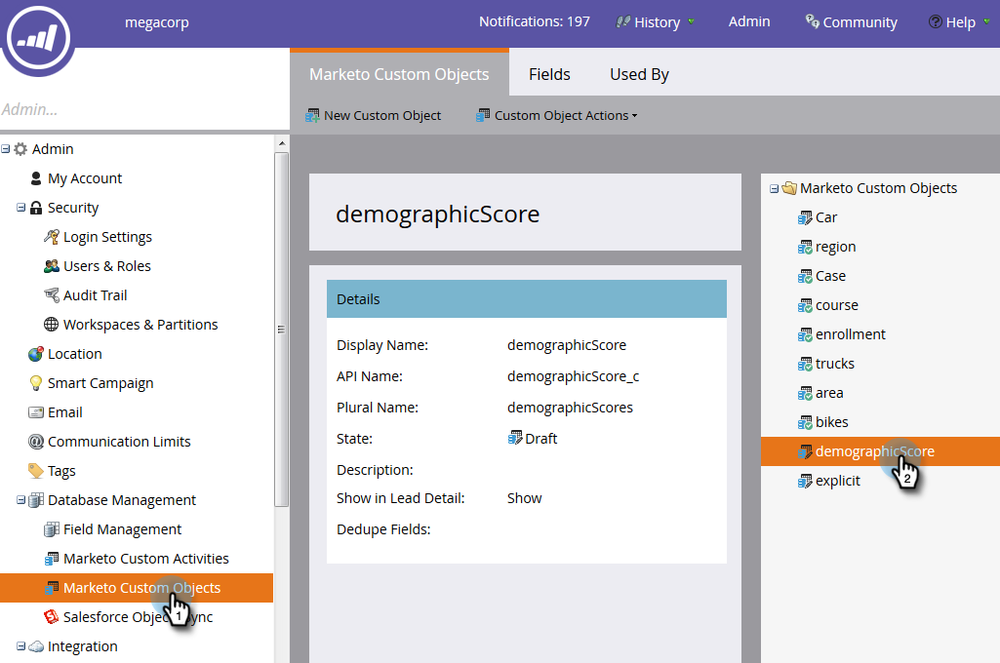
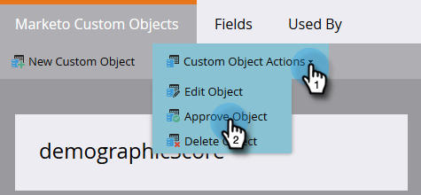

# Approve a Custom Object {#approve-a-custom-object}

You must approve a custom object before you can use it. The process is slightly different for new custom objects and ones that you've edited.

## Approve a New Custom Object {#approve-a-new-custom-object}

You've created a brand new custom object. Here's how to approve it.

1. In **[!UICONTROL Admin]**, click **[!UICONTROL Marketo Custom Objects]** and select an object that's in a **[!UICONTROL Draft]** **[!UICONTROL State]**.

   

1. Click the **[!UICONTROL Custom Object Actions]** drop-down and select **[!UICONTROL Approve Object]**.

   

1. The **[!UICONTROL State]** changes to **[!UICONTROL Approved]**.

   

   >[!NOTE]
   >
   >A custom object used in a _one-to-many structure_ must have at least one dedupe field, a link field, a linked object name, and a linked field name to be approved.
   >
   >A custom object used in a _many-to-many structure_ **doesn't** need a link field, linked object name, or a linked field name when you approve it (because they live in the intermediary object).
   >
   >A custom object used as an _intermediary object_ requires a link field, linked object name, and linked field name but **doesn't** require a dedupe field.
   >
   >See [Understanding Marketo Custom Objects](/help/marketo/product-docs/administration/marketo-custom-objects/understanding-marketo-custom-objects.md) for more information.

That's it! Now, you can select your custom object in the constraints of your filters and triggers to use in your campaigns.

## Approve an Edited Custom Object {#approve-an-edited-custom-object}

After you edit an approved custom object, you must approve the draft to return the custom object to an Approved state.

1. When you edit an already approved custom object, it receives an **[!UICONTROL Approved with Draft]** **[!UICONTROL State]**.

   

1. When you're ready to approve the draft, click the **[!UICONTROL Custom Object Actions]** drop-down and select **[!UICONTROL Approve Object]**.

   

1. A **[!UICONTROL Preview]** displays the items that were changed in the draft. Click **[!UICONTROL Approve]**.

   
