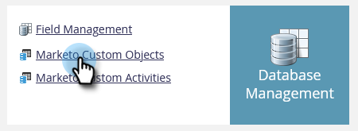
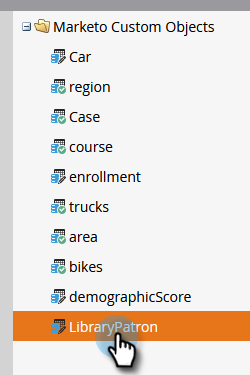
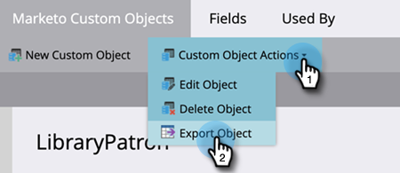
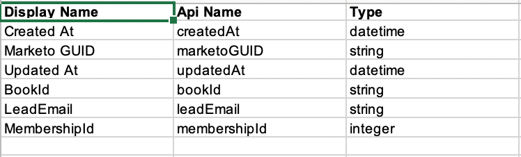
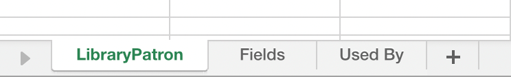

# Custom Object Metadata Export {#custom-object-metadata-export}

If you're using our SOAP API or Munchkin API, Custom Object Metadata Schema can be exported. Here's how to get it.

>[!AVAILABILITY]
>
>Not all customers have purchased this feature. Please contact the Adobe Account Team (your Account Manager) for details.

1. In My Marketo, click **Admin**.

   

1. Click **Marketo Custom Objects**.

   

1. Select the Marketo Custom Object you want to export.

   

1. Click the **Custom Object Actions** drop-down and select **Export Object**.

   

>[!NOTE]
>
>The Custom Object must be in Approved State to be exported.

You now have a spreadsheet with the Schema of the Custom Object, across three tabs.

   

   
