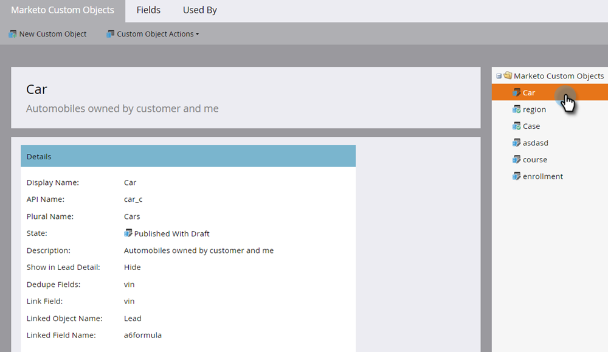
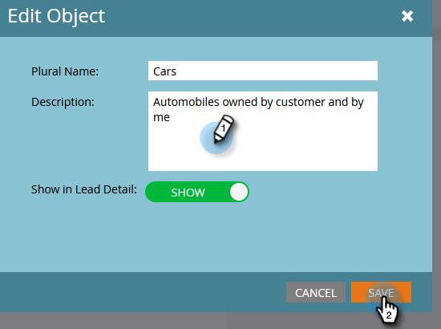
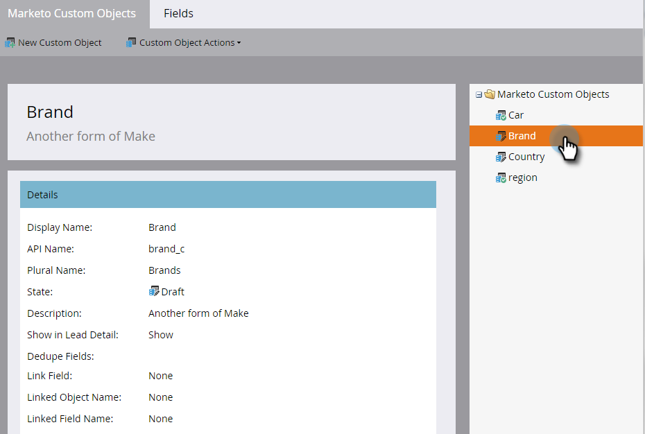
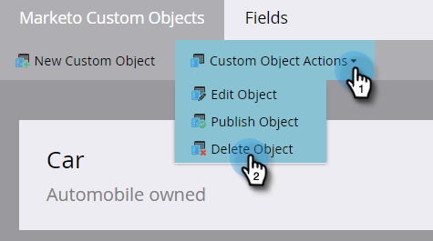

# Edit and Delete a Marketo Custom Object {#edit-and-delete-a-marketo-custom-object}

>[!NOTE]
>
>You cannot create, edit, or delete a Link or Dedupe Field once the custom object is approved.

## Edit a Custom Object {#edit-a-custom-object}

Use the Custom Object Actions menu to edit or delete a custom object.

1. Go to the **Admin** area.

   

1. Click **Marketo Custom Objects**.

   

1. Select the custom object you want to edit on the right.

   

1. Click the **Custom Object Actions** tab and click **Edit Object**.

   

1. Make your desired changes. Drag the slider over if you want to show the object on the Lead Detail page. Click **Save**.

   

1. Be sure to approve [the edited object](/help/marketo/product-docs/administration/marketo-custom-objects/approve-a-custom-object.md).

## Delete a Custom Object {#delete-a-custom-object}

It's easy to delete a custom object, but you need to be careful. Custom objects may be connected to other objects or to smart lists. So, Marketo warns you before letting you click **Delete**.

>[!CAUTION]
>
>You cannot restore a custom object after you delete it.

1. Go to the **Admin** area.

   

1. Click **Marketo Custom Objects**.

   

1. Select the object you want to delete.

   

1. Click **Custom Object Actions** and select **Delete Object**.

   

   >[!TIP]
   >
   >You can also right-click the object and select **Delete Object**.

1. If the custom object is in draft form, not approved yet, you'll get this warning. If you're sure, click **Delete**.

   

1. If the custom object is already approved, there is greater risk if you delete it. So, you'll get this sterner warning. Enter **I understand**, check the **Cannot Undo** checkbox, and click **Delete**.

   

   >[!NOTE]
   >
   >If the custom object is linked to an intermediary object, you must delete the intermediary object first.

>[!MORELIKETHIS]
>
>[Approve a Custom Object](/help/marketo/product-docs/administration/marketo-custom-objects/approve-a-custom-object.md)
