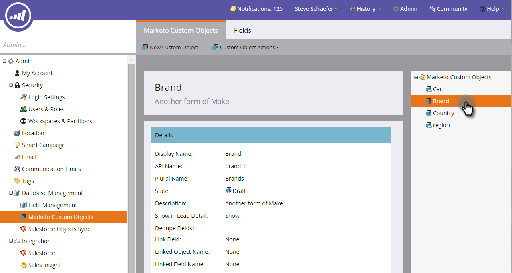
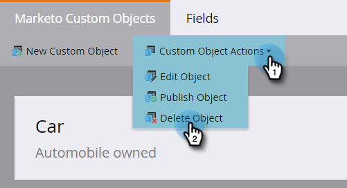
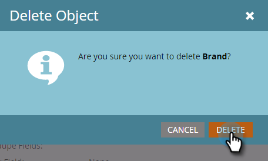

# Edit and Delete a Marketo Custom Object {#edit-and-delete-a-marketo-custom-object}

>[!NOTE]
>
>You cannot create, edit, or delete a Link or Dedupe Field once the custom object is approved.

## Edit a Custom Object {#edit-a-custom-object}

Use the Custom Object Actions menu to edit or delete a custom object.

1. Click **Admin**, and in **Database Management**, select **Marketo Custom Objects**.

   

1. Select the custom object you want to edit on the right.

   

1. Click the **Custom Object Actions** tab and click **Edit Object**.

   

   >[!NOTE]
   >
   >Edit Object shows the same fields as Create Object, except for the API name, which can't be edited.

1. Make any changes. Drag the slider over if you want to show the object on the Lead Detail page. Click **Save**.

   

1. Be sure to approve [the edited object](/help/marketo/product-docs/administration/marketo-custom-objects/approve-a-custom-object.md).

## Delete a Custom Object {#delete-a-custom-object}

It's easy to delete a custom object, but you need to be careful. Custom objects may be connected to other objects or to smart lists. So, Marketo warns you before letting you click **Delete**.

>[!CAUTION]
>
>You can't restore a custom object after you delete it.

1. Click **Admin**, and in **Database Management**, select **Marketo Custom Objects**.

   

1. Select the object you want to delete.

   

1. Click **Custom Object Actions** and select **Delete Object**.

   

   >[!TIP]
   >
   >You can also right-click the object and select **Delete Object**.

1. If the custom object is in draft form, not approved yet, you'll get this warning. If you're sure, click **Delete**.

   

1. If the custom object is already approved, there is greater risk if you delete it. So, you'll get this sterner warning. Enter **I understand**, check the **Cannot Undo** checkbox, and click **Delete**.

   

   >[!NOTE]
   >
   >If the custom object is linked to an intermediary object, you must delete the intermediary object first.

>[!MORELIKETHIS]
>
>[Approve a Custom Object](/help/marketo/product-docs/administration/marketo-custom-objects/approve-a-custom-object.md)
