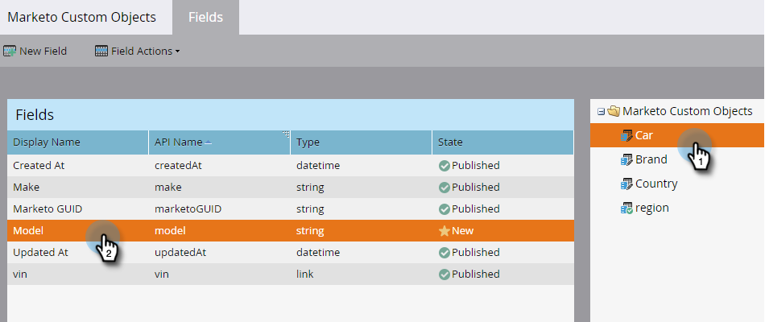
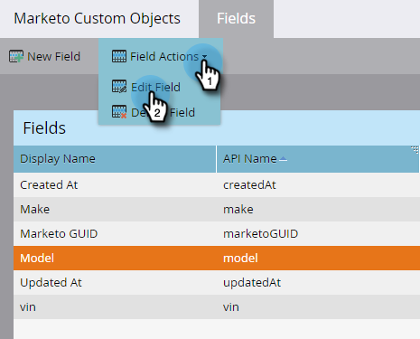
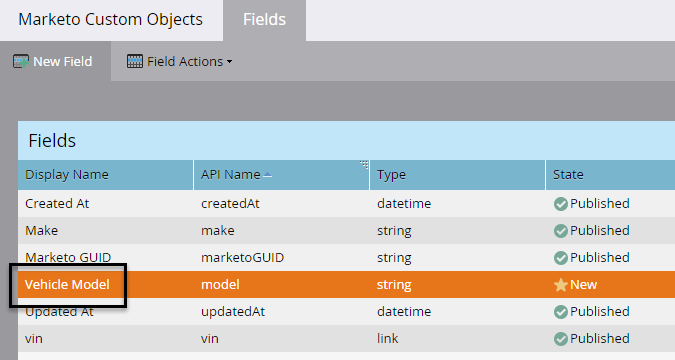
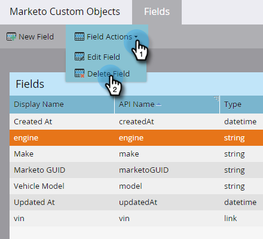
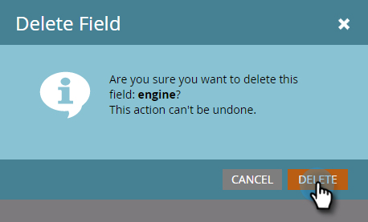
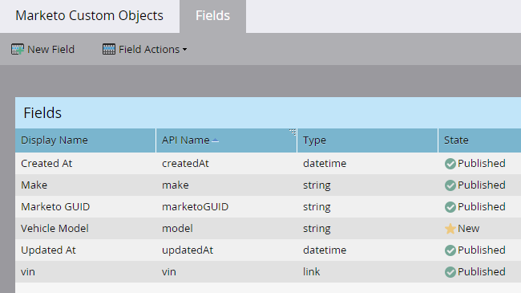

# Edit and Delete Marketo Custom Object Fields {#edit-and-delete-marketo-custom-object-fields}

## Edit a Field {#edit-a-field}

Sometimes you need to edit a field that's not approved yet.

1. Click a custom object and the field you want to edit.

   

1. On the Fields tab, click **Field Actions** and **Edit Field**.

   

1. Make your changes and click **Save**.

   

   >[!NOTE]
   >
   >You can't edit the API name.

1. The changes appear in the Fields listing.

   

## Delete a Field {#delete-a-field}

When you don't need a field in a custom object anymore, you can delete it.

1. On the Fields tab, click **Field Actions** and **Delete Field**.

   

   Make sure you really want to delete the field before you pull the trigger! Click **Delete**.

   

   It's gone!

   

   >[!NOTE]
   >
   >[Add Marketo Custom Object Fields](/help/marketo/product-docs/administration/marketo-custom-objects/add-marketo-custom-object-fields.md)
