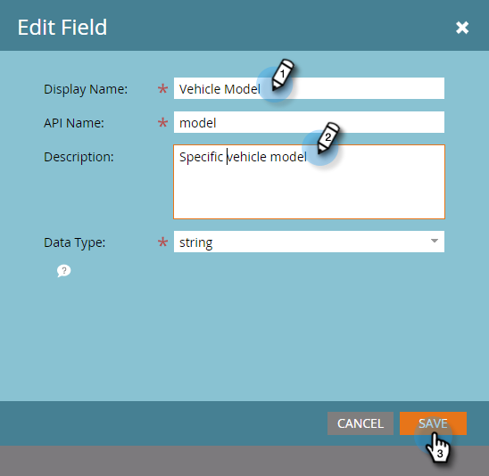
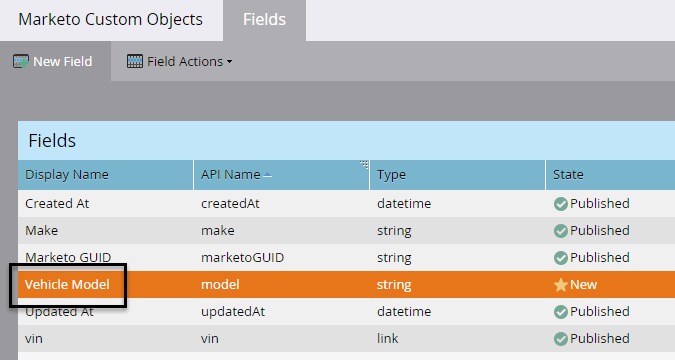

# Edit and Delete Marketo Custom Object Fields {#edit-and-delete-marketo-custom-object-fields}

## Edit a Field {#edit-a-field}

Sometimes you need to edit a field that is not approved yet.

1. Click a custom object and the field you want to edit.

   

1. In the [!UICONTROL Fields] tab, click **[!UICONTROL Field Actions]** and **[!UICONTROL Edit Field]**.

   

1. Make your changes and click **[!UICONTROL Save]**.

   

   >[!NOTE]
   >
   >You cannot edit the API Name.

1. The changes appear in the **[!UICONTROL Fields]** listing.

   

## Delete a Field {#delete-a-field}

When a field in a custom object is no longer needed, you can delete it.

1. In the Fields tab, click **[!UICONTROL Field Actions]** and **[!UICONTROL Delete Field]**.

   

1. Confirm that you want to delete the field before proceeding. Click **[!UICONTROL Delete]**.

   

The field is deleted.

   

   >[!NOTE]
   >
   >[Add Marketo Custom Object Fields](/help/marketo/product-docs/administration/marketo-custom-objects/add-marketo-custom-object-fields.md)
