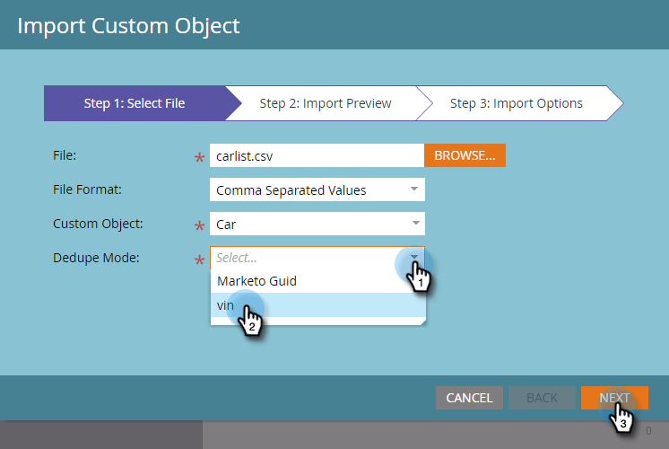
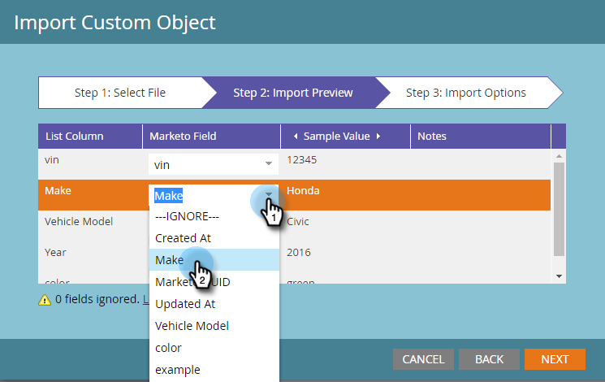
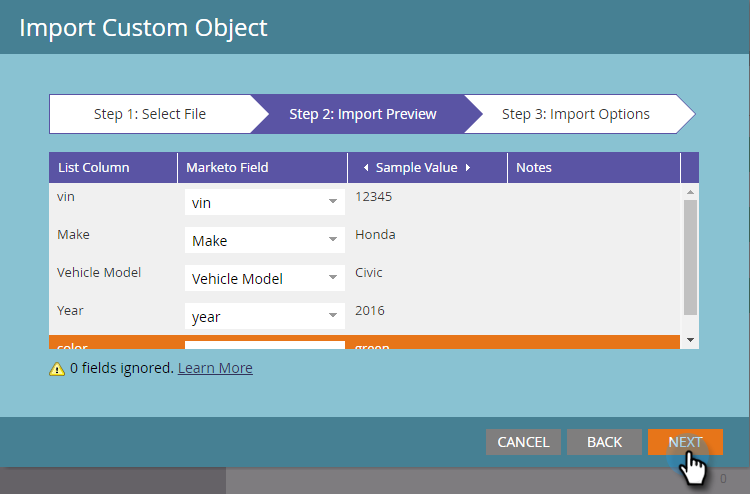

# Import Custom Object Data {#import-custom-object-data}

It's easy to import custom object data into your database. If you're using custom objects with companies, see [Using Custom Objects with Companies](/help/marketo/product-docs/administration/marketo-custom-objects/understanding-marketo-custom-objects.md#using-custom-objects-with-companies) for more information.

1. In My Marketo, go to **Database**.

   

1. Click **New** and select **Import Custom Object Data**.

   

1. Click **Browse** to locate the data file. Select the file format (Comma Separated Values in this example).

   

1. Select your custom object.

   

1. Select the Dedupe Mode from the drop-down. Click **Next**.

   

   >[!NOTE]
   >
   >Use Dedupe field(s) as unique identifiers when you create or update custom object records. This example uses the Dedupe field of the **car** custom object - vin (vehicle ID number). If you are only updating custom object records, you can select the Marketo Guid as the Dedupe Mode.

1. Map each column to a Marketo field, selecting it from the drop-down.

   

   >[!NOTE]
   >
   >Make sure the values in your file match the type of field you're matching them to (e.g., text, integer, etc.), otherwise the file will be rejected.

1. Click **Next**.

   

1. Click **Import**.

   

   >[!NOTE]
   >
   >The size limit for custom objects is 100MB.

   >[!TIP]
   >
   >Enter your email address in the **Send Alert To:** field and Marketo will email you when your import is done!

1. In the upper right corner of your screen, you'll see a notification while the import is running, and the final results when it completes.

   

   Yay!

>[!MORELIKETHIS]
>
>[Understanding Marketo Custom Objects](/help/marketo/product-docs/administration/marketo-custom-objects/understanding-marketo-custom-objects.md)
