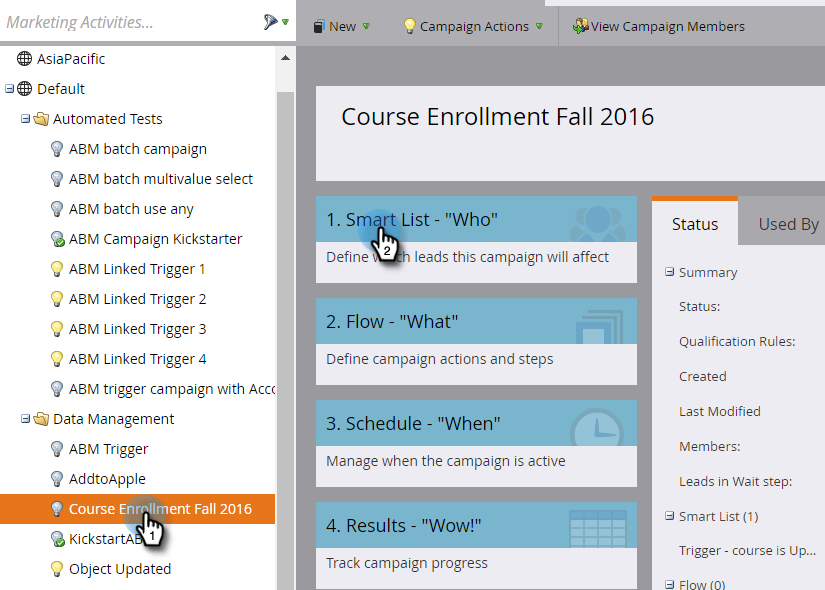
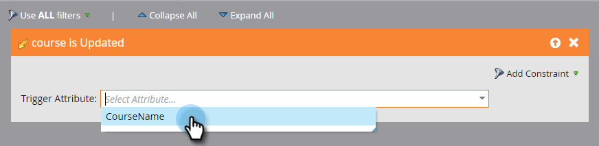
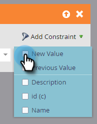
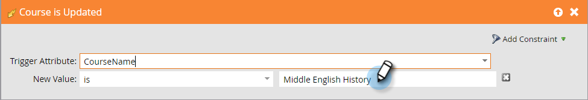

# Trigger Off Custom Object Changes {#trigger-off-custom-object-changes}

>[!NOTE]
>
>This feature is available only:
>
>* For customers on the Orion infrastructure
>* For use only with Marketo custom objects, not custom objects synced through the native Salesforce or Microsoft Dynamics integration
>* As a trigger, not a filter
>
>Please contact [Marketo Support](https://nation.marketo.com/t5/Support/ct-p/Support) to have Custom Object Change Triggers enabled.

In a smart campaign's smart list, you can trigger a flow action when a custom object is added to a person or company. You can also create a smart list that uses a *change* in a custom object as a trigger. For example, use it to send an email when a course name is updated.

>[!NOTE]
>
>An activity log entry is not created when a custom object record is changed.

1. In Marketo, go to **Marketing Activities.**

   

1. Create or open an existing Smart Campaign, and select the Smart List.

   

1. Search for the trigger you need and drag it onto the canvas.

   

1. Select the trigger attribute.

   

1. Optionally, set a constraint.

   

1. And there you are. The change is automatically saved.

   

   >[!NOTE]
   >
   >* [Create a Smart List](/help/marketo/product-docs/core-marketo-concepts/smart-lists-and-static-lists/creating-a-smart-list/create-a-smart-list.md)
   >* [Understanding Marketo Custom Objects](/help/marketo/product-docs/administration/marketo-custom-objects/understanding-marketo-custom-objects.md)
