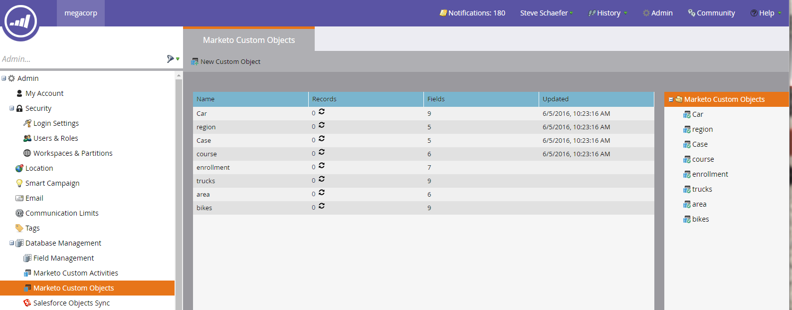
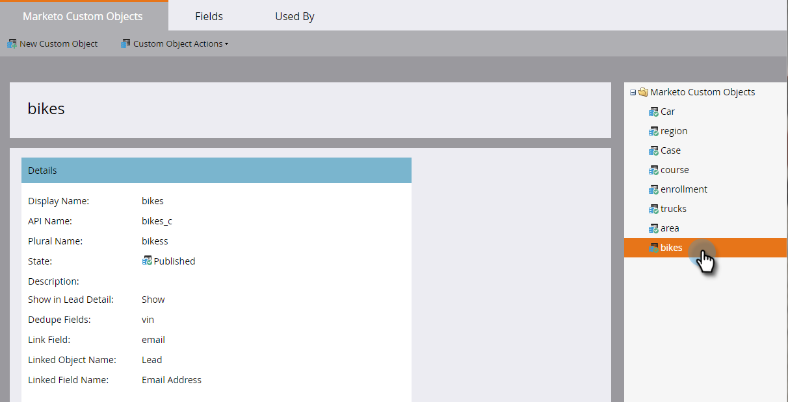
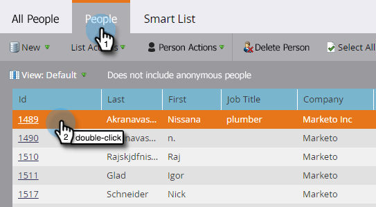
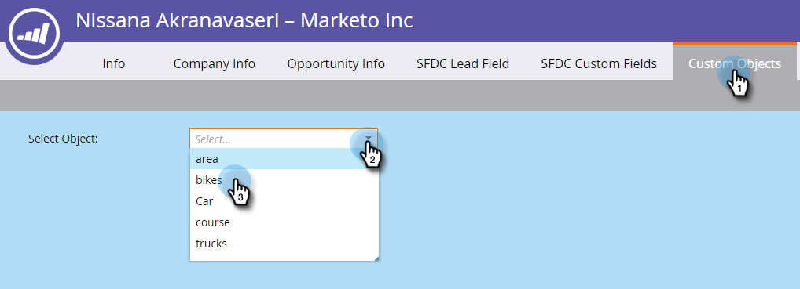

# Understanding Marketo Custom Objects {#understanding-marketo-custom-objects}

Use custom objects to track metrics specific to your business.

>[!NOTE]
>
>**FYI**
>
>Marketo is now standardizing language across all subscriptions, so you may see lead/leads in your subscription and person/people in docs.marketo.com. These terms mean the same thing; it does not affect article instructions. There are some other changes, too. [Learn more](http://docs.marketo.com/display/DOCS/Updates+to+Marketo+Terminology).

>[!NOTE]
>
>**Availability**
>
>Not all customers have purchased this functionality. Contact your sales rep for details.

Use custom objects as filters and triggers in your smart campaigns. For example:

* **Filter**: Send emails only to owners of a specific vehicle brand
* **Trigger**: Send an email when a custom object is added to a person or company.

You can set up custom objects in a one-to-many or a many-to-many relationship. For example:

* **One-to-many**: One person owns several cars 
* **Many-to-many**: Multiple students are enrolled in multiple courses from a course catalog 

A one-to-many structure uses a single link field to connect the custom object to a person or a company.

Many-to-many custom objects use two link fields, part of an intermediary object. One Link field is connected to the person or company and another is connected to the custom object, such as the course catalog. This intermediary object can contain additional custom fields, such as a course grade or an attendance date, which further defines the nature of the connection.

>[!TIP]
>
>Import custom objects using comma separated values (CSV) within the user interface to test and validate a data sample. Then, upload all of your files with an API. 

>[!CAUTION]
>
>You can't restore custom objects, so be sure you don't need them anymore before deleting them.

## Accessing Marketo Custom Objects {#accessing-marketo-custom-objects}

1. To create or edit Marketo custom objects, click **Admin **and then the **Marketo Custom Object**s link.

   

1. The Marketo Custom Objects display lists all of your custom objects on the right, but only the approved ones in the main grid.

   

1. The grid displays the object name, number of records, number of fields, and the date of the most recent update.

   >[!TIP]
   >
   >Marketo updates these fields automatically, but you can refresh the display by clicking the icon in the Records column.

1. Click the object name on the right to open the details page.

   

## View Custom Objects Associated to a Person {#view-custom-objects-associated-to-a-person}

After you've created the custom object structure, when you upload the specific custom object data, the custom objects are automatically associated to people in the database using the link field in the custom object. You can view information from the Custom Objects tab on the person details page.

1. Go to **Database**.

   

1. Open your database and click the **People** tab. Double-click the record for a person you associated to a custom object.

   

1. On the person detail page, click the **Custom Objects** tab. Select the object from the drop-down.

   

1. Now you can view a list of all custom objects of that type that are associated to that person.

   

## Using Custom Objects with Companies {#using-custom-objects-with-companies}

   A custom object that's linked to the company works best if you sync down companies from the CRM or if you explicitly create companies using the API. We also recommend that you use the Company ID as the link field.

   If you have multiple people in Marketo that are records in the CRM or Marketo-only records, a custom object linked to a company won't get associated with more than one individual record. This is because a company having multiple people underneath it is supported only when companies are synced down from the CRM or if you use an API to explicitly create companies.

   Custom Objects can only directly link to a single record. This means that when your custom object type is linked by company field, you should ensure that your person records are associated to a company either using contact conversion in your CRM, or using the externalCompanyId field, if you manage companies using Marketo’s REST APIs. For person records that aren't linked explicitly to company records, custom objects linked using company will be randomly linked to a single record, even if the value of the company field is shared across many people.

   See [Import Custom Object Data](import-custom-object-data.md) for more information.

>[!NOTE]
>
>**Related Articles**
>
>* [Create Marketo Custom Objects](create-marketo-custom-objects.md)
>* [Approve a Custom Object](approve-a-custom-object.md)
>* [Edit and Delete a Marketo Custom Object](edit-and-delete-a-marketo-custom-object.md)
>* [Add Marketo Custom Object Fields](add-marketo-custom-object-fields.md)
>* [Edit and Delete Marketo Custom Object Fields](edit-and-delete-marketo-custom-object-fields.md)
>* [Import Custom Object Data](import-custom-object-data.md)
>

