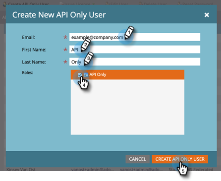

# Add API Only User for Adobe IMS Enabled Subscriptions {#add-api-only-user-for-adobe-ims-enabled-subscriptions}

While Marketo Engage Marketing Users and Administrators are managed in Adobe Admin Console, Marketo Engage API Only Users must be created and managed in Marketo Engage.

The steps below describe how to add an API Only User in Marketo Engage. Before doing so, you must have [established an API Only Role](/help/marketo/product-docs/administration/users-and-roles/create-an-api-only-user-role.md).  

1. In Marketo, click **Admin** and select **Users & Roles**.

   

1. Click **Create API Only User**.

   

1. Enter an Email, First Name, and Last Name for the API only user.  Select the API Only Role you want to assign to the user. Click **Create API Only User** when done.

   

>[!NOTE]
>
>When the action succeeds, the Create API Only User modal will close and the Users list will refresh, and the new user will be visible.
