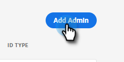
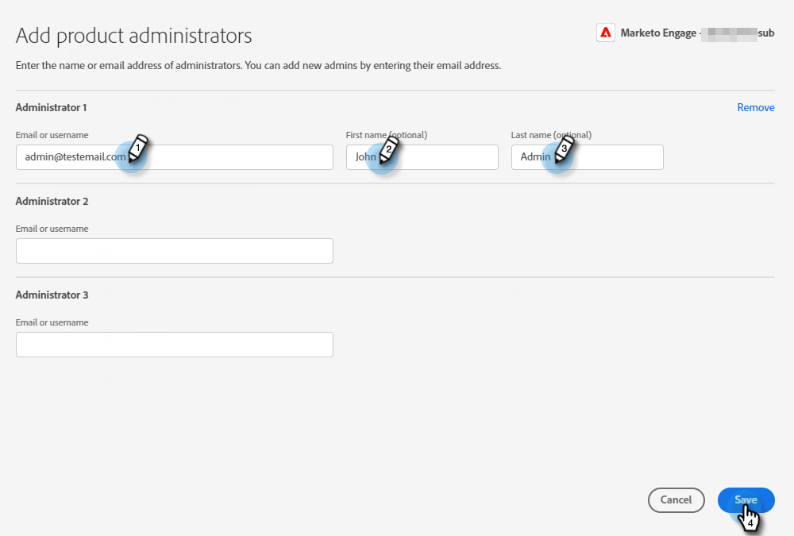
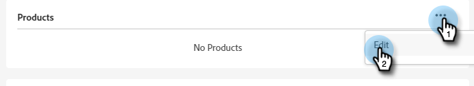
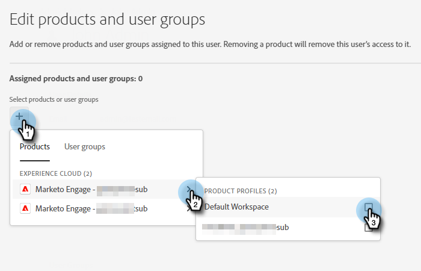
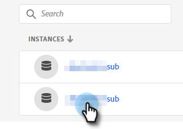
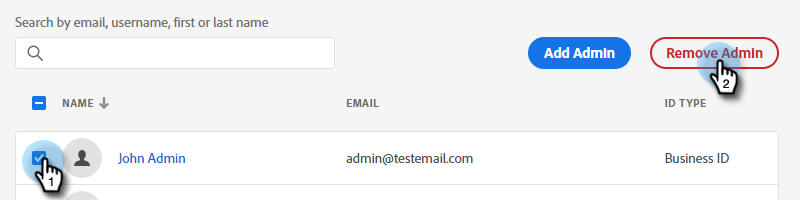

# Add or Remove a Product Admin {#add-or-remove-a-product-admin}

>[!NOTE]
>
>**System** Admins are only created at the Adobe Org level. If you think you need more than one, please contact [Marketo Support](https://nation.marketo.com/t5/support/ct-p/Support).

## Add a Product Admin {#add-a-product-admin}

>[!IMPORTANT]
>
>An Admin must be added to a product profile in order to get access to Marketo Engage.

1. Log in to the [Adobe Admin Console](https://adminconsole.adobe.com/){target="_blank"}.

   

1. Click **Marketo Engage**.

   

1. Select the desired subscription (if you have more than one).

   

1. Click the **[!UICONTROL Admins]** tab.

   

1. Click the **[!UICONTROL Add Admin]** button.

   

1. Enter the email address or username of the Admin you'd like to add. First and last name are optional. Click **[!UICONTROL Save]**.

   

1. Click the name of the Admin you just added.

   

1. Under Products, click the three-dot menu and select **[!UICONTROL Edit]**.

   

1. Click the **+** sign. Click the chevron next to the desired Marketo Engage subscription (if there are more than one) and select the desired product profile.

   

1. Click **[!UICONTROL Save]**.

   

The user will then receive two emails. The first email notifies them they've been granted Product Admin rights to Marketo Engage. The second email invites them to sign in to Marketo Engage.

>[!NOTE]
>
>When the product admin user is added to Marketo Engage via the Adobe Admin Console, the user is granted the Adobe Product Admin role within the subscription.

## Remove an Admin {#remove-a-user}

1. Log in to the [Adobe Admin Console](https://adminconsole.adobe.com/){target="_blank"}.

   

1. Click **Marketo Engage**.

   

1. Select the desired subscription (if you have more than one).

   

1. Click the **[!UICONTROL Admins]** tab.

   

1. Select the Admin you want to remove and click the **[!UICONTROL Remove Admin]** button.

   

1. Click **[!UICONTROL Remove Admin]** to confirm.

   

The user will then receive an email notifying them they no longer have Product Admin access to Marketo Engage.
