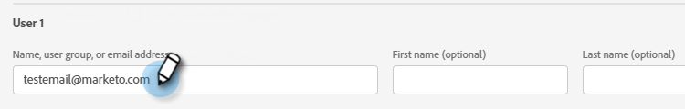
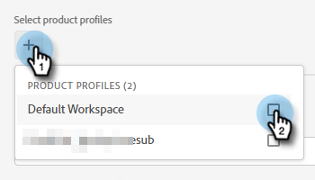
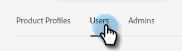
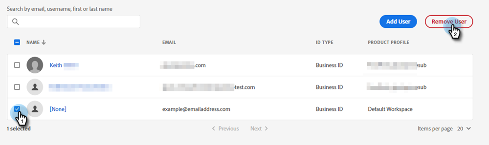

# Add or Remove a User {#add-or-remove-a-user}

## Add a User {#add-a-user}

1. Log in to the [Adobe Admin Console](https://adminconsole.adobe.com/).

   

1. Click **Marketo Engage**.

   

1. Select the desired subscription (if you have more than one).

   

1. Click the **Users** tab.

   

1. Click the **Add User** button.

   

1. Enter the name, user group, or email address of the user you'd like to add. First and last name are optional.

   

1. Click the **+** icon and select the desired product profile.

   

1. Click **Save**.

   

The user will then receive an email to log in to Marketo.

>[!NOTE]
>
>When the user is added to Marketo Engage via the Adobe Admin Console, they're granted the "Standard User" role within the Default workspace of the subscription. If the user’s role within the workspace needs to be adjusted, that is done in Marketo Engage, [as described here](/help/marketo/product-docs/administration/users-and-roles/managing-user-roles-and-permissions.md).

## Remove a User {#remove-a-user}

1. Log in to the [Adobe Admin Console](https://adminconsole.adobe.com/).

   

1. Click **Marketo Engage**.

   

1. Select the desired subscription (if you have more than one).

   

1. Click the **Users** tab.

   

1. Select the user you want to remove and click the **Remove** button.

   

1. Click **Remove User** to confirm.

   

The user will then receive an email notifying them they no longer have Product Admin access to Marketo Engage.

>[!MORELIKETHIS]
>
>* [Adobe Admin Console Users](https://helpx.adobe.com/enterprise/using/users.html)
>* [Manage Users Individually](https://helpx.adobe.com/enterprise/using/manage-users-individually.html)
