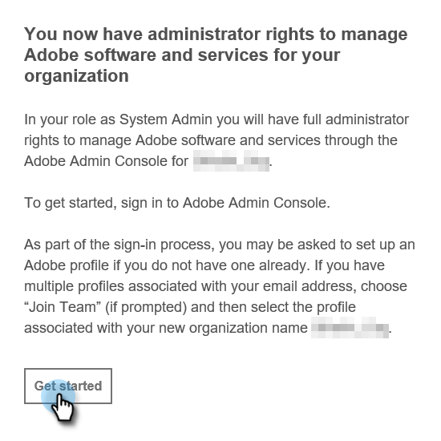
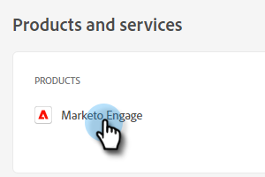
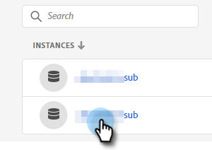
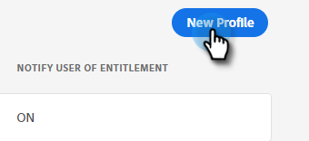
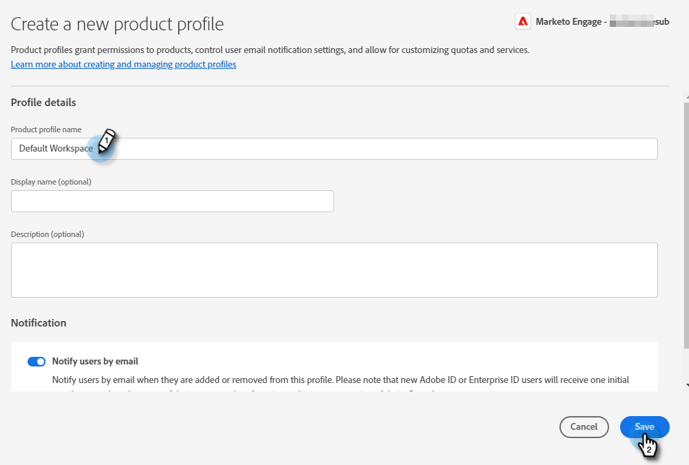

# Admin Setup {#admin-setup}

Once you're added as an Adobe System Admin to Marketo Engage in an Adobe org, there are a few steps you'll need to take to complete the initial setup.

## Initial Setup {#initial-setup}

1. After you've been added as a designated System Admin for Marketo Engage (in a new or established org), you'll receive a welcome email. In that email, click **Get Started**.

   

1. If you've previously accessed an application with an Adobe ID, you'll be taken straight to the Adobe Admin Console. If not, [set up your Adobe ID](https://helpx.adobe.com/manage-account/using/create-update-adobe-id.html){target="_blank"}.

   

## Create a Product Profile {#create-a-product-profile}

After the System Admin accesses the Admin Console, it's time to create a product profile. This is how your users/Admins get access to Marketo Engage.

1. In the Overview page, under Products and Services, click **Marketo Engage**.

   

1. Choose the desired subscription. If you only have one, skip to the next step.

   

   >[!NOTE]
   >
   >If you do have multiple subscriptions, these steps must be followed for each one.

1. Click the **New Profile** button.

   

1. Give your Product Profile a name (Display Name and Description are optional) and click **Save**.

   

>[!NOTE]
>
>If you set up multiple product profiles, users will have the same access to Marketo, regardless of which profile they're added to.

>[!MORELIKETHIS]
>
>[Add or Remove a Product Admin](/help/marketo/product-docs/administration/marketo-with-adobe-identity/add-or-remove-a-product-admin.md){target="_blank"}
