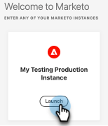

# Adobe Identity Management FAQ {#adobe-identity-management-faq}

**What is Adobe Identity?**

Adobe Identity Management System consists of three components.

* [!DNL Adobe Identity Service]: Handles authentication and validation of the end-user, including federation and runtime Single-Sign-On (SSO).

* Adobe Admin Console: The Admin Console provides a central location for managing Adobe entitlements across your entire organization. It handles user management, cloud service, desktop license entitlement, federation configuration, and provides data loss prevention security features.

* Adobe User Management API (UMAPI): Allows organizations to manage enterprise users and entitlements in the Adobe Admin Console at the API level.

**When will existing Marketo Engage subscriptions be integrated with IMS?**

Existing Marketo Engage subscriptions are currently being migrated to the Adobe IMS upon any sales event, which includes renewals, re-contracting events, and/or addendums. Migrations outside of a sales event are supported as of October 2024.

**After migration, will Marketo Engage URLs remain the same?**

No. URLs will appear in the following format after migration: `https://experience.adobe.com/#/@tenantID/so:XXX-XXX-XXX/marketo-engage/classic/` (the XXXs represent the Munchkin ID, and @tenantID is from your Adobe org).

**Is there anything we need to do to prepare for the URL change?**

Yes. After migration, Marketo Engage will go from being served from experience.adobe.com to Adobe Experience Cloud. You'll need to work with your IT team to allowlist all Adobe domains listed [at the top of this article](/help/marketo/getting-started/initial-setup/configure-protocols-for-marketo.md){target="_blank"} to prevent disruption to Marketo Engage access.

Previous links and bookmarks to Marketo Engage assets on the engage-xx.marketo.com domain _will_ continue to function. However, you must first log in to the Marketo Engage instance for the URL you are navigating to. For example, to navigate to a bookmark for a Smart Campaign in instance with Munchkin ID 123-ABC-456, you need to first log in to the Marketo Engage instance with Munchkin ID 123-ABC-456.

While not planned, future development work can break this redirect function. To avoid unexpected interruptions, it is recommended to update bookmarks at your earliest convenience.

**Does this work with SSO?**

Yes. The integration with Adobe IMS supports Universal ID users and SSO. SSO is now driven by Adobe IMS and is set up at the organization level in the Adobe Admin Console. However, there are differences in the Marketo Engage IdP-initiated support compared to Adobe's SP-initiated support ([learn more here](https://helpx.adobe.com/enterprise/using/set-up-identity.html){target="_blank"}). If you need help regarding SSO differences after being migrated to Admin Console, please contact [Adobe Customer Care](https://helpx.adobe.com/contact.html){target="_blank"}.

**What's the difference between an Adobe Product Admin and a Marketo Engage Admin?**

* Adobe Product Admin is a new role in the Marketo platform.
* Adobe Product Admin role is granted to users added as a Product Admin in Adobe Admin Console
* Adobe Product Admin is a read-only role and can't be edited or deleted from Marketo Engage.
* Adobe Product Admin has the same rights and privileges as a standard Marketo Admin.
* Marketo Engage Admin's role is still an Admin and is granted to a user in Marketo Engage.
* Only users with the Marketo default Admin role are assigned as a Marketo Product Admin in the Admin Console.

**Is there any change in User Management API client support?**

Yes. Those who've been onboarded to Adobe IMS cannot utilize all the existing Marketo User Management APIs. For user invite, update, and deletion actions, the Adobe [IMS APIs](https://www.adobe.io/apis/experienceplatform/umapi-new.html){target="_blank"} should be used. For role management, the Marketo User Management APIs still apply. Beyond this there are no other changes to Marketo REST API client support.

**Who do we contact for support if we are integrated with IMS?**

* Pre-user Migration: file support cases in the [Marketing Nation Community](https://nation.marketo.com/t5/support/ct-p/Support) or email `customercare@marketo.com`.

* Post-user Migration: file support cases in the [Marketing Nation Community](https://nation.marketo.com/t5/support/ct-p/Support) or email `customercare@marketo.com`.

* Post-Support Migration Completion: Product Support Administrators can file cases via the Experience League Support portal.

If you have Ultimate Success, you have access to Admin Console Migration White Glove Service. Please reach out to the Adobe Account team (your Account Manager) for assistance.

**If I use an Adobe Identity to access other Adobe applications, can I use that to access Marketo?**

Even if you have other Adobe products, you cannot access Marketo with Adobe Identity until the subscription is migrated to IMS.

**Are Marketo user roles (within workspaces) managed in Adobe Admin Console?**

No. User Role management (within workspaces) is completed in Marketo Engage.

**I'm a Marketo Admin in an IMS integrated subscription and don't have access to the Admin Console. How do I gain access?**

Any Adobe System or Product Admin that has access to your organization's Admin Console can give you access. If you're not sure who in your organization has admin privileges in the console, contact [Adobe Customer Care](https://helpx.adobe.com/contact.html){target="_blank"}.

**How would an Admin add users to Marketo [!DNL Sales Connect]?**

While there will be a product card in Admin Console for [!DNL Sales Connect], Admin Console should not be used to add/manage users. The following link will allow Admins to manage users via Marketo [!DNL Sales Connect]: [https://toutapp.com/next#settings/admin/user-management](https://toutapp.com/next#settings/admin/user-management){target="_blank"}.

**Where can I learn more about the Adobe Admin Console?**

[https://helpx.adobe.com/enterprise/admin-guide.html](https://helpx.adobe.com/enterprise/admin-guide.html){target="_blank"}.

**Do I still go to the Admin section in Marketo to make user account changes for my account?**

No, you would need to navigate to [account.adobe.com](https://account.adobe.com){target="_blank"}.

**How does this work with Marketo's Universal ID?**

Those onboarded to Adobe identity can access all IMS-enabled subscriptions seamlessly via the subscription switcher in the product.

**Does this work with SSO?**

Yes. Marketo integration with Adobe IMS supports Universal ID users and SSO. SSO is now driven by Adobe IMS and is set up at the organization level in the Adobe Admin Console. [Learn more here](https://helpx.adobe.com/enterprise/using/set-up-identity.html){target="_blank"}.

**I've already been onboarded to Adobe Identity and now I want to implement SSO. What do I do?**

If you want to implement Single Sign On and your subscription has been onboarded to Adobe Identity without SSO implemented in the Adobe Org, please submit a ticket to [Marketo Support](https://nation.marketo.com/){target="_blank"} and specify the topic as "Marketo on Admin Console, implementing SSO."

**How does device authorization work?**

Adobe IMS does not currently support anything like Marketo's device authorization feature.

**Is it still possible to use the "Login in Invite User Dialog" feature, to make a user's login unique from their email?**

No. The User Invite workflow is no longer active when a subscription is IMS-enabled, so the feature is no longer valid. Adobe identity requires a user's identity to be driven by their email.

**For Adobe IMS, do we have the option to use Adobe ID, Enterprise ID, or Federated ID?**

Yes, you determine the type of identity to have your organization support. More info can be found here: [Identity Overview](https://helpx.adobe.com/enterprise/using/identity.html) and here: [Set up Identity](https://helpx.adobe.com/enterprise/using/set-up-identity.html){target="_blank"}.

**Which product cards are supported in the Adobe Admin Console?**

The supported product cards are: Marketo Engage, Marketo Measure, Marketo Dynamic Chat, Marketo Sales Connect, and Marketo Sales Insight Actions.

**What if my user login doesn't match my email when I get migrated to an Adobe Identity?**

Current Marketo Engage users with logins different from their email address will no longer log in with that credential once migrated to an Adobe Identity. Adobe Identities always authenticate with a user's email address. You can update an Adobe identity email address at [account.adobe.com](https://account.adobe.com){target="_blank"}.

**What happens after the Adobe Identity migration if my subscription uses IP restriction settings?**

When subscriptions are onboarded to Adobe Identity, IP restriction settings do not get migrated to the Adobe Admin Console. Marketo's IP restriction settings include allowing only access from specific IP addresses, and blocking specific IP addresses from access. At this time, Adobe Identity Management System does not support IP restriction features.

Coming in mid-2025, Adobe Identity Management System will release a feature allowing only specific IP addresses, supporting a transition for Marketo users currently utilizing this feature. Those who currently use this feature will not undergo user migration until the feature is released. Once the feature is delivered, users will be notified of their migration being scheduled. More information about the feature will be provided when available.

Users who currently use the IP restriction, blocking specific addresses from access, will no longer be able to use this feature after being migrated to Adobe Identity, as it is not supported by Adobe Identity Management System.

**What happens after Adobe Identity migration if I have users with a role that has the option to 'Bypass Single Sign On'?**

Adobe Admin Console comes with a default Business ID directory. Users outside of the domains claimed in Federated ID directories in an Adobe Org will be assigned to this directory with an Adobe ID identity type. These users will be able to access Marketo Engage without going through Single Sign On (SSO) and the license ownership remains with the company, not the individuals.

**I have more than one subscription, but not all have Single Sign On enabled. What happens after Adobe Identity migration?**

When subscriptions are onboarded to Adobe Identity, Single Sign On (SSO) is set up at the Adobe Organization level. This means SSO applies to all product instances in the Adobe Org. When SSO is set up, it will apply to all Marketo instances in that Adobe Org. Previously, Marketo supported this setting at an instance level. That is not supported by Adobe Identity Management System.

**Are any changes needed to CNAMEs, SPF, or DKIM we currently use for Marketo Engage after the Adobe Identity migration?**

No, there are no impacts to these configurations.

**How can I prevent sessions from timing out?**

In [Advanced Settings](https://helpx.adobe.com/enterprise/using/authentication-settings.html#advanced-settings){target="_blank"}, you can customize the desired maximum session life (System Admin permissions required). It's recommended to establish this setting after product migration, but before user migration.

**I now have to navigate into Experience Cloud to access Marketo Engage. Is there a way to streamline this flow?**

Yes. You can create a browser bookmark of the link that launches after clicking the **Launch** button on the Marketo Engage instance entrance page to bypass that page going forward.

   
