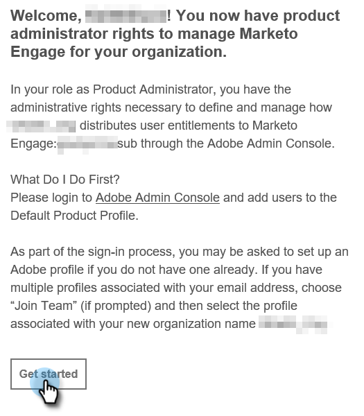
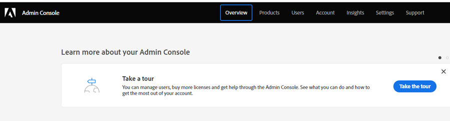

# Product Admin Setup {#product-admin-setup}

1. After you've been invited by a System Admin, you'll receive a welcome email. In that email, click **[!UICONTROL Get Started]**.

   

1. If you've previously accessed an application with an Adobe ID, you'll be taken straight to the Adobe Admin Console. If not, [set up your Adobe ID](https://helpx.adobe.com/manage-account/using/create-update-adobe-id.html).

   

It's that simple! Product Admins are primarily responsible for adding users. [Learn how to do that here](/help/marketo/product-docs/administration/marketo-with-adobe-identity/add-or-remove-a-user.md#add-a-user).
