# Migrating to Adobe Identity {#migrating-to-adobe-identity}

When Adobe schedules a subscription's user migration, Marketo Engage product administrators will get access to the Migration Console, which can be found in the navigation menu in the Admin area under Integration.

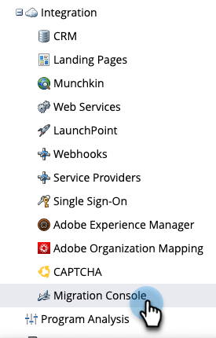

## Pre-Migration {#pre-migration}

Prior to migration beginning, an Admin can modify the user migration start date for their subscription by navigating to the Pre-Migration screen in the Migration Console. To change the date, the administrator can click the **Edit** button.

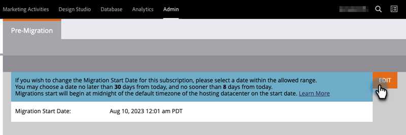

The administrator can choose a date between 8 and 30 days in the future. When a date is selected, the administrator must click **Save** to make the change.

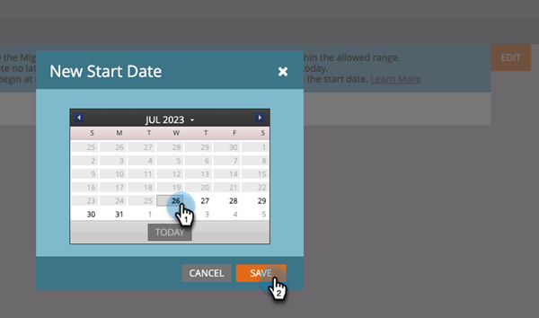

>[!NOTE] 
>
>To request a date before 8 days or beyond 30, or if you need to adjust the date after the pre-migration console locks, send an email to `marketocares@marketo.com`.

## Migrations to Adobe Identity {#migrations-to-adobe-identity}

All Marketo subscriptions with a U.S. time zone will be migrated starting at midnight, Pacific Standard Time, of the user migration start date. User migration for all other subscriptions will begin at midnight of the subscription's specified time zone. When a subscription's user migration begins, user management will no longer be available in the Marketo Admin area, and will only be achieved in the Adobe Admin Console. Role management remains in the Users and Roles tab in the Marketo Admin area, as well as local (API-only) user management.

Adobe will automatically migrate all Marketo Admins with verified emails first. When Marketo Admins are migrated to Adobe Identity, they will be added to the subscription's Adobe Admin Console as a Product Administrator for the Marketo subscription and be assigned the Adobe Product Admin role within the Marketo application (along with any other roles they previously had) and have their Adobe ID entitled to the subscription. The administrators will receive two emails. One indicating being assigned as an Adobe Product Administrator, and the other indicating their Adobe ID being entitled to the Marketo product.

**Marketo Product Administrator Email** 

**Marketo Entitlement Email**

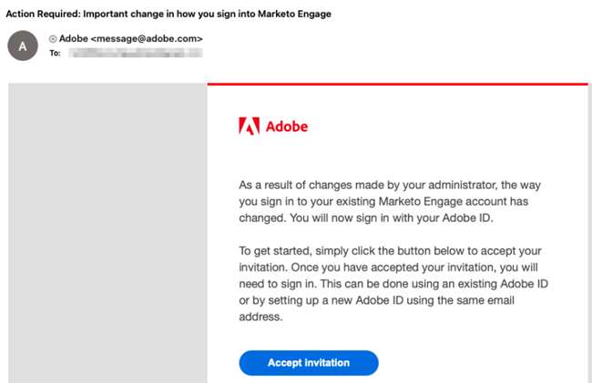

**If your Marketo subscription has less than 75 users and does not have SSO in Marketo and/or your Adobe Org**, Adobe will automatically migrate the rest of your users. This workflow aims to deliver the highest level of automation, and no action is required to execute the migration. Upon migration completion, the Marketo Migration Console will no longer appear in the Marketo Admin navigation area and all users will access Marketo using an Adobe ID.

**If your Marketo subscription has 75 or more users or has SSO in Marketo and/or your Adobe Org**, Marketo Product Admins will gain access to the Self-Service User Migration tool of the Migration Console upon user migration beginning and be alerted via banner upon login on the My Marketo page. The administrator will be responsible for completing the user migration using the Self-Service User Migration tool. 

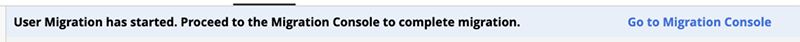

## Marketo Self-Service User Migration {#marketo-self-service-user-migration}

The Marketo Self-Service User Migration Console tool consists of two tabs.

* **Migration Status tab**
* **User Migration tab**  

### Migration Status Tab {#migration-status-tab}

The Migration Status tab provides overall metrics on the progress of users' email verification prerequisite, users' migration and activation, and completion of the subscription migration.

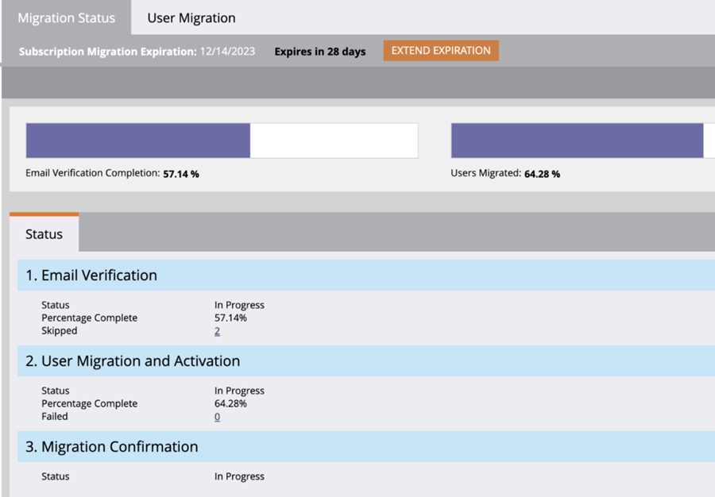

At the top of the Migration Status, the subscription migration expiration and button to extend the expiration are displayed. More information on migration expiration can be found in the [User Migration Expiration section](#user-migration-expiration).

In the next section of the Migration Status tab, there are two progress bars. The first progress bar is to show the progression of user email verification completion. The second progress bar is to show the progression of user migration completion. 

Next, there are three sections of the Status displayed to the admin. 

* **User Email Verification**: verification status of users within the subscription. 
* **User Migration and Activation**: user migration and activation (migration and entitlement to the Marketo Engage product) status of the users within the subscription. 
* **Migration Confirmation**: migration completion status of the subscription. 

#### User Email Verification {#user-email-verification}

In the User Email Verification section, an administrator can find the current status of email verification for the users in the subscription, prior to migration to Adobe Identity.  

An administrator can view the email verification status of the subscription, the percentage of users in the subscription who have completed email verification, and the number of users who have been marked as skipped. Status will be reported upon the status of all users' email verification state in the subscription. The administrator can click on the number of skipped users and will be navigated to the User Migration tab to view the skipped users. 

The verification email can be resent by an administrator in the User Migration tab of the Migration Console and the User & Roles tab in the Marketo Admin area, or by the user in their Account Settings. Like user invitation emails, the link in the verification email expires in 3 days. More information on email verification can be found on the [Community](https://nation.marketo.com/) and in the [email verification documentation](/help/marketo/product-docs/administration/users-and-roles/email-verification.md).     

>[!IMPORTANT] 
>
>If a Marketo Engage user does not verify their email address, they cannot be migrated to an Adobe ID and will lose access to the Marketo subscription after the migration is complete. To regain access, a Marketo product admin would need to add them as a new user. 

#### User Migration and Activation {#user-migration-and-activation}

In the User Migration and Activation section, an Administrator can find the current status of total user migration and entitlement to the Adobe Identity Management System.  

An administrator can view the percentage of users in their subscription who have been migrated to an Adobe ID or marked as Skipped. Status will be reported upon the status of all users' migration state to an Adobe ID in the subscription, or marked as Skipped and won't be migrated. As users are migrated and entitled to Marketo Engage, or skipped, this status will be updated.  

#### Migration Confirmation {#migration-confirmation}

In the Migration Confirmation section, an administrator will be required to confirm user migration is complete for the subscription.  

Once all users in the subscription are accounted for (either migrated or skipped), the button to 'Complete Migration' will appear.  

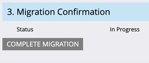

The administrator conducting migration will need to complete the migration confirmation by clicking the **Complete Migration** button. They will be prompted to **Confirm**.

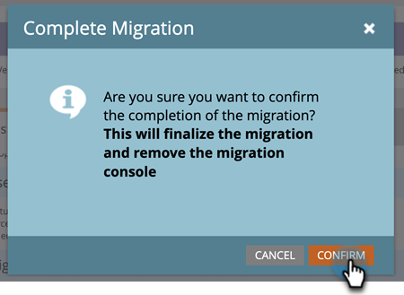

After user migration completion is confirmed, the Migration Console will be removed from the Admin navigation menu. 

### User Migration Expiration {#user-migration-expiration}

Adobe requires customers to complete self-service migrations within 30 days. Administrators will not be blocked from migrating users or completing migration if the expiration date has past, however, they will only be able to migrate users on demand. If an administrator needs more time, they can extend the subscription's expiration date.

Upon clicking the **Extend Expiration** button, the date will be updated to one week later. An administrator can extend their expiration up to three times.

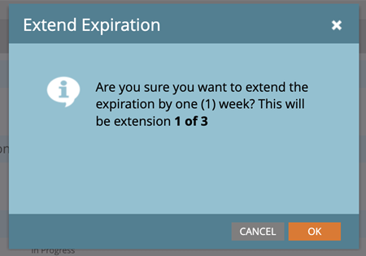

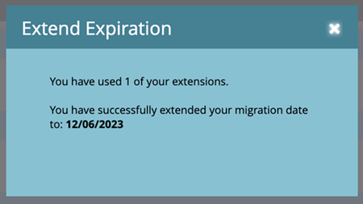

Adobe will reach out if you do not complete the migration by the expiration date. 

### User Migration Tab {#user-migration-tab}

The User Migration tab provides administrators the tools to have full control of user migration.  

Administrators have the option to: 

* Trigger verification emails for unverified users via the 'Verify Email' button 
* Skip user migration for users who the admin knows can/will not verify their email or shouldn't be migrated via the 'Skip Migration' button  
* Migrate selected user(s) on demand via the 'Migrate Now' button 
* Schedule user migration for selected user(s) for a specific date via the 'Schedule Migration' button 
* Migrate all eligible users on demand (no user selection needed) via the 'Migrate All Users' button

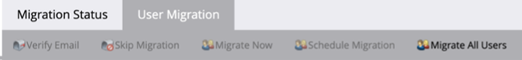

**Verify Email** 

Email verification is required for a user to be migrated to an Adobe ID. If there are any users who have not verified their email address and need to be migrated, the administrator can trigger the verification email to be sent to the user again. By selecting an unverified user, the 'Verify Email' button will become clickable.

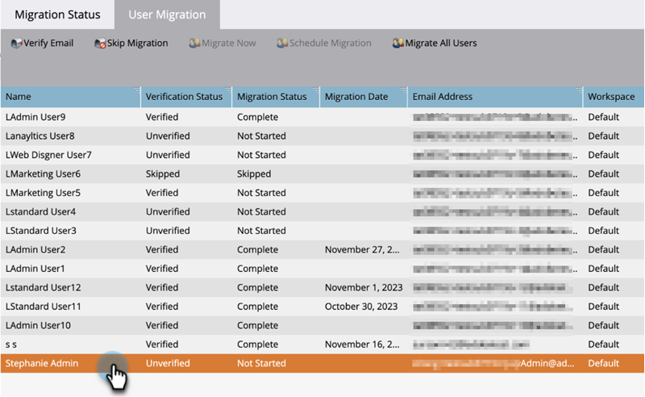

When the administrator clicks the **Verify Email** button, they'll receive a notification the email was sent.

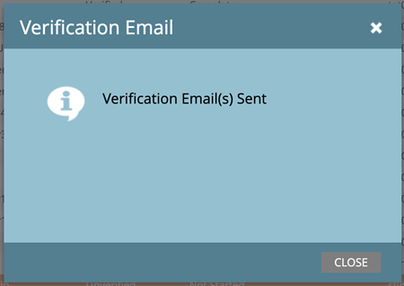

**Skip and Unskip User Migration** 

During user migration, all users need to be either migrated or skipped. Adobe requires administrators to acknowledge that a user will not be migrated and an administrator needs to mark the user as skipped. If the administrator does not, they won't be able to confirm the completion of user migration. All skipped users will lose access to Marketo once user migration is complete. 

>[!IMPORTANT]  
>
>An administrator must skip all users with unverified emails. If there are users who have verified their emails, but the administrator does not wish to migrate them for any reason, they should mark them as skipped. 

To skip a user, the administrator can select the desired user(s). The 'Skip Migration' button will become clickable. Upon clicking the **Skip Migration** button, the page will refresh and the selected user's verification status and migration status will be updated to 'Skipped'.

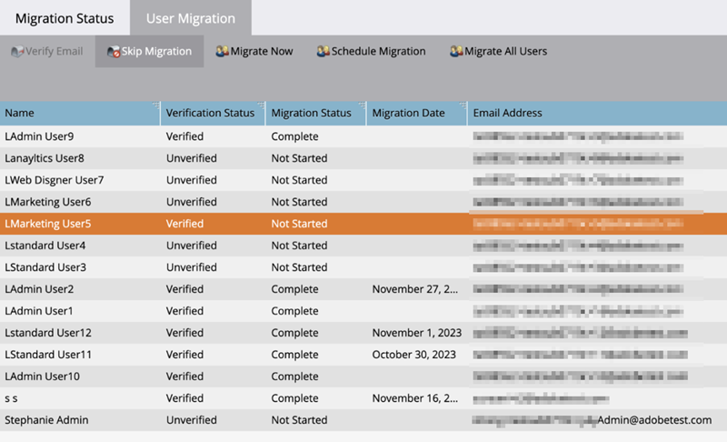

An administrator can unskip a previously skipped user, if it's determined that user needs to be migrated.  

To unskip a user, the administrator can select the desired user. The 'Unskip Migration' button will become clickable. Upon clicking the **Unskip Migration** button, the page will refresh.  The selected user's verification status will be updated to its current status, either 'Verified' or 'Unverified', and the user's migration status will be updated to 'Not Started.' 

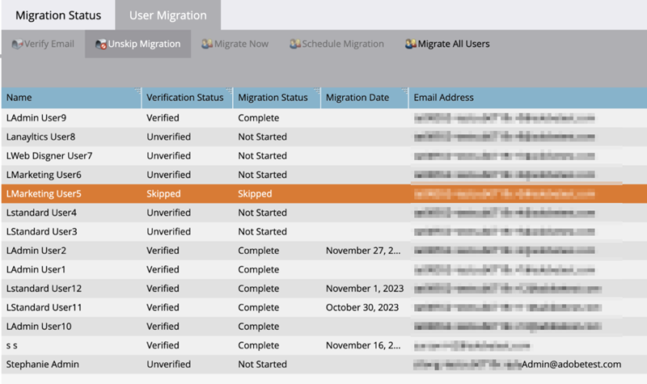

>[!NOTE] 
>
>The 'Unskip Migration' button will only be active if all selected users have a 'Skipped' Migration Status.

### Migrating Marketo Users to Adobe IDs {#migrating-marketo-users-to-adobe-ids}

Marketo product administrators will be able to select users to migrate in batches, or all eligible users at once. Once users are selected, administrators have the option to "Migrate Now" or "Schedule Migration" for a later date, giving Admins flexibility and control over which users are migrated and when. Administrators are also presented with the option to "Migrate All Users" in a subscription.

For example, an administrator can select a group of "power users" they want to migrate first. Once those user migrations are successfully completed, they can select different groups of users based on variables such as workspace/business or function/role to further batch user migrations by. Or, they can decide to migrate the rest of the users in the subscriptions after the success of the first batch. The goal is to provide the most flexibility in rolling out Adobe IDs to users.

All user migrations occur concurrently and should complete successfully within sixty seconds. While user migration is occurring for a specific user, the user could lose access for up to 1 minute, and that is only if the user is logged into the application. Upon completion of user migration, the user will receive an email on how to sign into Marketo Engage with an Adobe Identity. The user needs to accept the invitation via the button link in the email. After accepting the invite, the user should sign in with an Adobe ID. Instructions on how to sign into Marketo Engage with an Adobe ID [can be found here](/help/marketo/product-docs/administration/marketo-with-adobe-identity/user-sign-in-with-adobe-id.md).

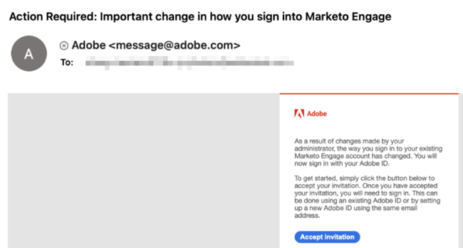

User migrations are processed independently, so if a user migration fails, Adobe will continue to process other user migrations. If a user migration failure occurs, there is no action required by an administrator. The Administrator will be sent an email notification about the error and alerted that Adobe is working to resolve the issue immediately. If a user's migration fails and that user is logged into Marketo Engage, the user could lose access for up to two minutes while migration reattempts occur. If a user's migration fails, the user can continue to access Marketo Engage with their Marketo identity until they receive email notification that their migration succeeded, and they are invited to sign in with an Adobe ID.  

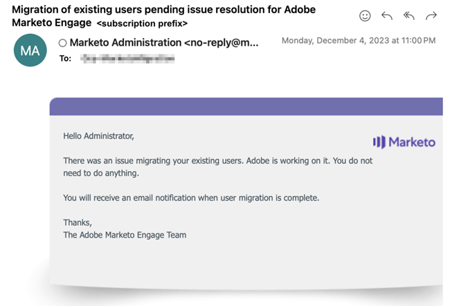

**Migrate Now**

An administrator can select one or more users to migrate on demand. This will trigger the migration of the users immediately. To migrate one or more users, the administrator can select the desired user(s), and the 'Migrate Now' button will become clickable.

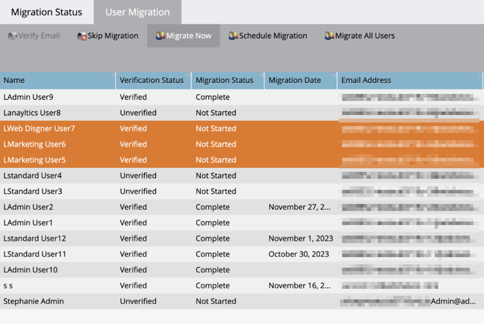

>[!NOTE]
>
>The 'Migrate Now' button will only be active if all selected users have a 'Verified' Verification Status.  

Upon clicking the **Migrate Now** button, the administrator will be prompted to confirm migration of the selected user(s). Once the administrator confirms, the user migrations will begin processing as soon as possible. 

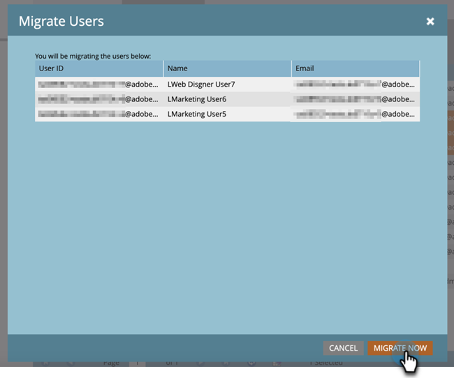

**Schedule Migration**

An administrator can select one or more users to schedule migration on a later date. To schedule migration for one or more users, the administrator selects the desired user(s) and the 'Schedule Migration' button will become clickable.  

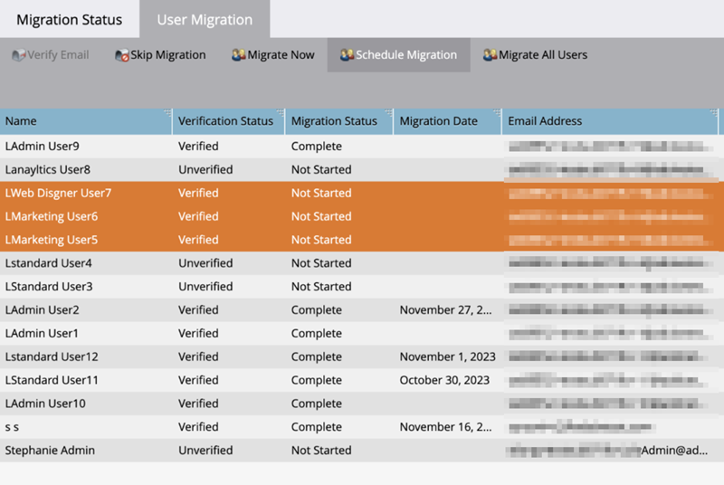

>[!NOTE]
>
>The 'Schedule Migration' button will only be active if all selected users have a Verification Status of "Verified."  

Upon clicking the **Schedule Migration** button, the administrator will be prompted to select the desired migration date of the selected user(s). The administrator can only select dates before the subscription's migration expiration date. When the administrator confirms, the user migration(s) will be scheduled to begin processing on the selected date.

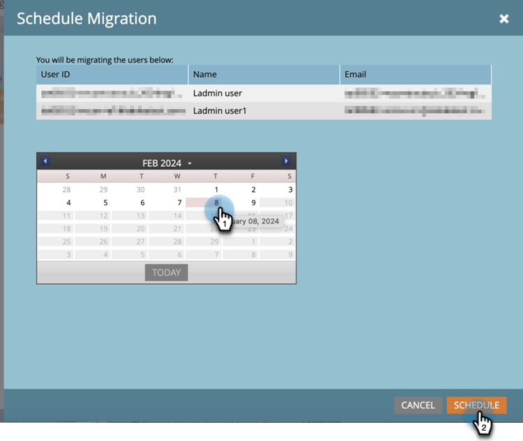

>[!NOTE]
>
>All Marketo subscriptions with a U.S. time zone will be migrated starting at midnight, Pacific Standard Time, of the migration start date. User migration for all other subscriptions will begin at midnight of the subscription's specified time zone.

**Migrate All Users**

An administrator can select to migrate all eligible users in a subscription, at any time. This will trigger the migration of the eligible users immediately. Eligible users are users with verified emails who have not yet been migrated.  

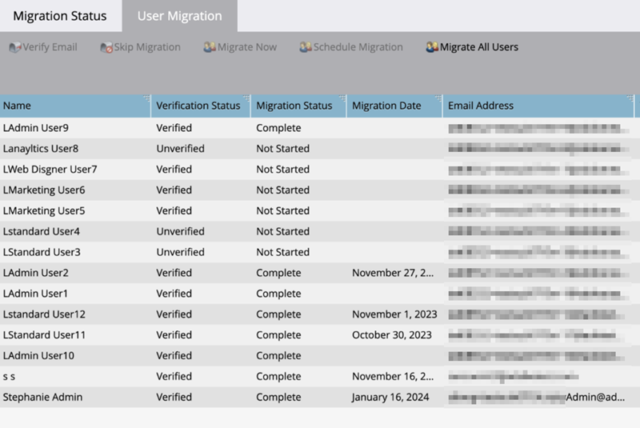

Upon clicking the **Migrate All Users** button, the administrator will be prompted to **Confirm** migration of all eligible users. When the administrator confirms, the user migrations will begin processing as soon as possible. 

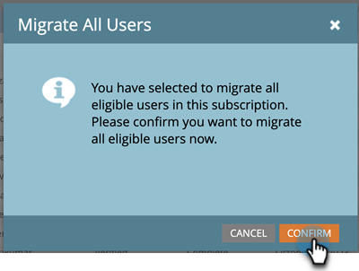
