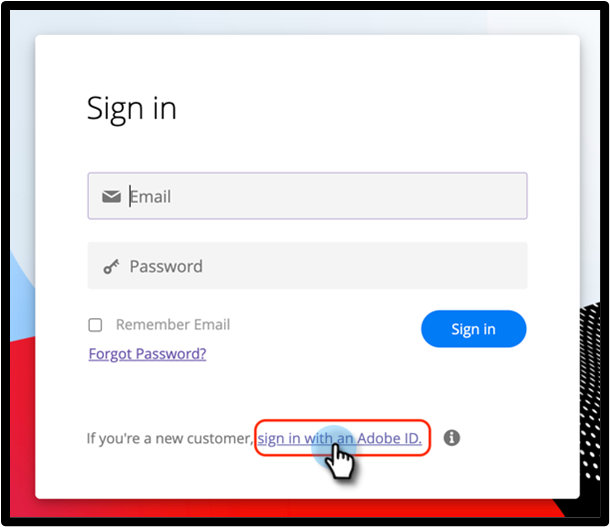
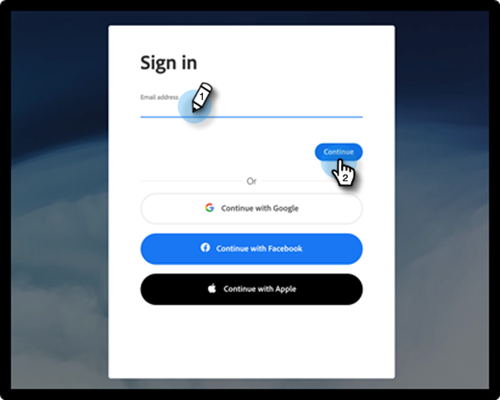

# User Sign-in with Adobe ID {#user-sign-in-with-adobe-id}

When a user with Adobe Identity needs to log in to the Marketo Engage Application, they must log in through the Adobe ID Login link versus the typical login on the Marketo Login page. Upon clicking the link, the user will be directed to the Marketo Engage Application.

1. Click the **Sign in with an Adobe ID** link on the Marketo login page.

   

1. Enter your Adobe credentials and click **Continue**.

   

Upon successful sign-in, you’ll be directed to the Marketo Engage application.
