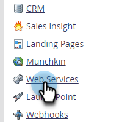
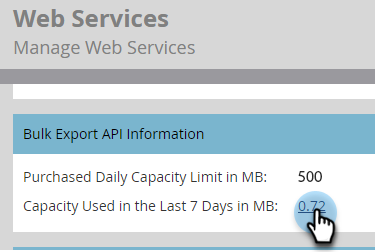
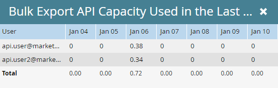

# Bulk Export API Information {#bulk-export-api-information}

Learn how to check how much [Bulk Extract API](https://developers.marketo.com/rest-api/bulk-extract/){target="_blank"} capacity has been taken up by your Marketo Engage instance over the last seven days.

>[!NOTE]
>
>If you need additional capacity, please contact your Account Representative.

1. Go to the **Admin** area.

   

1. Click **Web Services**.

   

1. Scroll down to the Bulk Export API Information card. Click the number next to "Last 7 Days" to see the usage per day/API user.

   

   

>[!NOTE]
>
>The alloction for your Marketo Engage instance resets daily at 12:00 a.m. CST.
