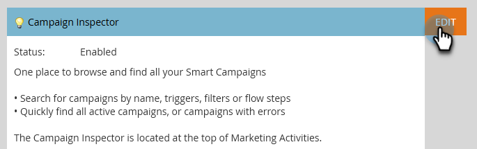

# Campaign Inspector {#campaign-inspector}

Use the Campaign Inspector to view and search all of your Smart Campaigns in one place.

## Enable Campaign Inspector {#enable-campaign-inspector}

1. Go to the **[!UICONTROL Admin]** area.

   

1. Click **[!UICONTROL Treasure Chest]**.

   

1. Click **[!UICONTROL Edit]** next to Campaign Inspector.

   

1. Select the **[!UICONTROL Enabled]** checkbox and click **[!UICONTROL Save]**.

   

   >[!NOTE]
   >
   >The desired workspace needs to be selected in the tree in order to see the Campaign Inspector tab after it has been enabled.

## Using Campaign Inspector {#using-campaign-inspector}

Once enabled, the Campaign Inspector tab can be found next to the Marketing Activities tab.

   

Click the **[!UICONTROL Active Campaigns]** drop-down to filter by different types of campaigns.

   

At the bottom of the page, access useful tools like the search bar, or exporting your results.

   
