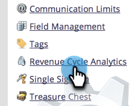
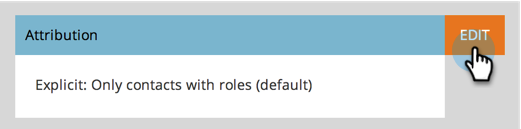

# Change Attribution Settings for Analytics {#change-attribution-settings-for-analytics}

You can change the way Marketo ties contacts to opportunities for first- and multi-touch attribution, lead conversion metrics, and the marketing-influenced opportunity flag.

These settings will impact Revenue Explorer reports under the [Program Opportunity Analysis](/help/marketo/product-docs/reporting/revenue-cycle-analytics/program-analytics/understanding-the-program-opportunity-analysis-area.md), [Opportunity Analysis](/help/marketo/product-docs/reporting/revenue-cycle-analytics/revenue-explorer/understanding-opportunity-analysis-in-revenue-explorer.md), and Lead Analysis areas. This will also affect the Program Analyzer report.

1. Go to the **Admin** area. 

   

1. Click **Revenue Cycle Analytics**.

   

1. Click the **Edit** link under **Attribution**.

   

   >[!TIP]
   >
   >Changing this setting does not modify any Marketo data; it simply changes the way your reports run. This can be reverted at any time.

1. Select an option and click **Save**.

   

   >[!NOTE]
   >
   >**Definition**
   >
   >**Explicit**: Only contacts with roles (default).
   >
   >**Hybrid**: Contacts with roles if available. If none are available, it uses all contacts in accounts.
   >
   >**Implicit**: All contacts regardless of role.

>[!CAUTION]
>
>When using **Implicit**, Marketo will always examine all contacts associated to the account regardless of role. **Marketo strongly recommends using Explicit mode**. Using Implicit may create false positives; i.e., people with credit for an opportunity despite having no real influence in the opportunity. Use Implicit with caution.
