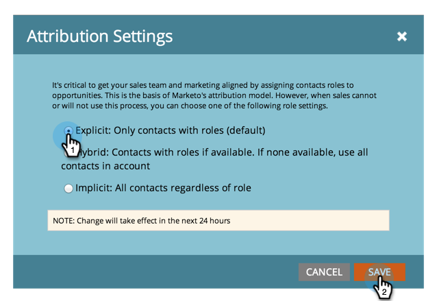

# Change Attribution Settings for Analytics {#change-attribution-settings-for-analytics}

You can change the way Marketo ties contacts to opportunities for first- and multi-touch attribution, lead conversion metrics, and the marketing-influenced opportunity flag.

1. Go to the **[!UICONTROL Admin]** area.

   

1. Click **[!UICONTROL Revenue Cycle Analytics]**.

   

1. Click the **[!UICONTROL Edit]** link under **[!UICONTROL Attribution]**.

   

   >[!TIP]
   >
   >Changing this setting does not modify any Marketo data; it changes the way your reports run. This can be reverted at any time.

1. Select an option and click **[!UICONTROL Save]**.

   

   >[!NOTE]
   >
   >**Definition**
   >
   >**[!UICONTROL Explicit]**: Only contacts with roles (default).
   >
   >**[!UICONTROL Hybrid]**: Contacts with roles if available. If none are available, it uses all contacts in accounts.
   >
   >**[!UICONTROL Implicit]**: All contacts regardless of role.

>[!CAUTION]
>
>When using **[!UICONTROL Implicit]**, Marketo will always examine all contacts associated to the account regardless of role. **Marketo strongly recommends using [!UICONTROL Explicit] mode**. Using [!UICONTROL Implicit] may create false positives; i.e., people with credit for an opportunity despite having no real influence in the opportunity. Use [!UICONTROL Implicit] with caution.
