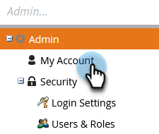
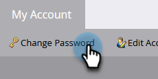

# Change Your Marketo Password {#change-your-marketo-password}

Change your Marketo password with these simple steps.

1. Go to the **[!UICONTROL Admin]** area.

   

1. Click **[!UICONTROL My Account]**.

   

1. Click **[!UICONTROL Change Password]**.

   

1. Enter the Old Password and New Password, then click **[!UICONTROL Save]**.

   

   >[!NOTE]
   >
   >Take note of the password requirements when you're making the update.
