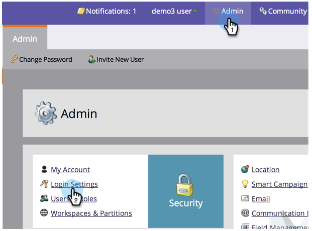

# Change your Password Security Settings {#change-your-password-security-settings}

Control the password policy of your subscription. Here's how.

>[!NOTE]
>
>**Admin Permissions Required**

1. Under **[!UICONTROL Admin]**, click **[!UICONTROL Login Settings]**.

   

1. Under **[!UICONTROL Security Settings]**, click **[!UICONTROL Edit]**.

   

1. Select a **[!UICONTROL Template]**. For advanced options, click the **[!UICONTROL Advanced]** drop-down.

   >[!NOTE]
   >
   >A template is just a pre-built configuration. **[!UICONTROL Standard Security]** is good. **[!UICONTROL High Security]** is the strongest. **[!UICONTROL Custom]** lets you make your own.

   

   >[!TIP]
   >
   >In **[!UICONTROL Custom]**, check the boxes to indicate which characteristics you want users to include when they create passwords.

1. Set the **[!UICONTROL Expiration]**. This feature automatically requires users to reset their passwords after a certain length of time. This includes the Admin user as well.

   >[!CAUTION]
   >
   >Existing users will not be notified of the changes. Set **[!UICONTROL Expiration]** to 30 days first to ensure everyone has updated to the new settings, then change this back to your original cadence.

   

1. Set the **[!UICONTROL Inactive Session Timeout]**. This determines how long a user can be inactive for before they have to re-login to Marketo.

   

   Security is serious business. We got your back.
