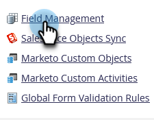
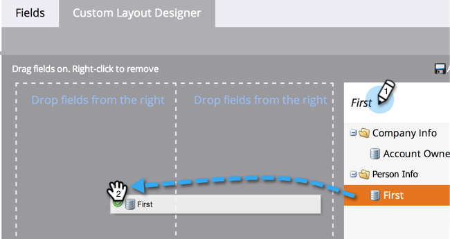
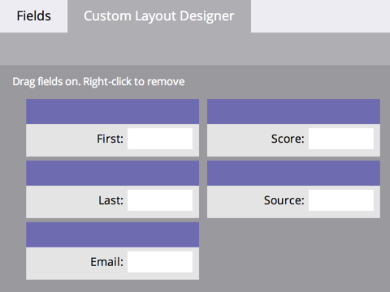
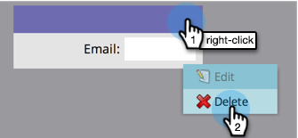
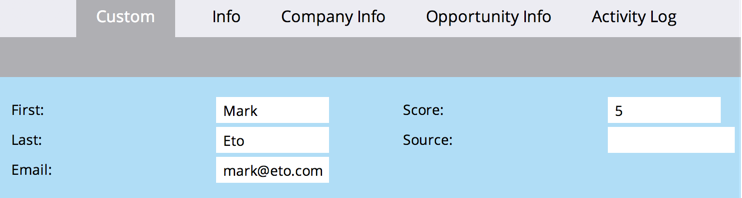

# Creating a Custom Tab for the Person Detail Page {#creating-a-custom-tab-for-the-person-detail-page}

If you find yourself looking for a specific set of fields in the person detail over and over again, consider creating a custom layout to make things easier.

1. Go to the **[!UICONTROL Admin]** area. 

   

1. Click **[!UICONTROL Field Management]**.

   

1. Click the **[!UICONTROL Custom Layout Designer]** tab.

   

1. Find a field you want to add, then drag and drop it into the canvas.

   

1. Continue adding fields until you have the layout the way you want it.

   

   >[!NOTE]
   >
   >You have two columns to work with.

   If you decide you want to remove a field, right-click the field you want to remove and click **[!UICONTROL Delete]**.

   

   Awesome work! Now when you load a person's details, you can use your custom layout to access the information important to you.

   
