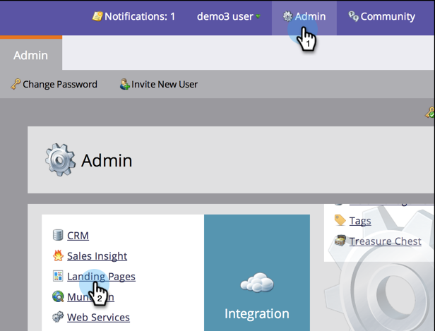
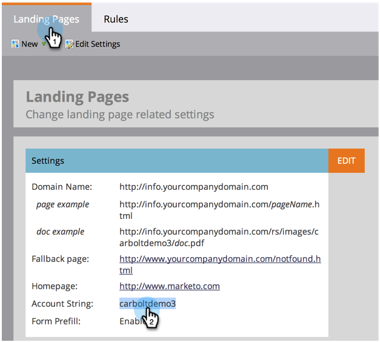

# Customize Your Landing Page URLs With a CNAME (Administration) {#customize-your-landing-page-urls-with-a-cname-administration}

Even though Marketo hosts your landing pages, the URL should be customized for your company.

>[!NOTE]
>
>No CNAME:
>
>https://na-sj02.marketo.com/lp/mktodemoaccount126/UnsubscribePage.html
>
>Branded CNAME:
>
>https://go.**YourCompany**.com/UnsuscribePage.html

>[!NOTE]
>
>**Admin Permissions Required**

Let's get you set up!

1. Choose a CNAME.

   It's the front part of the URL. Examples:

    * **go**.YourCompany.com/NameOfPage.html
    * **info**.YourCompany.com/NameOfPage.html
    * **pages**.YourCompany.com/NameOfPage.html

   The one word (plus YourCompany.com) is called a CNAME. You will need this later so make a note of it.

1. Find your **[!UICONTROL Account String]**.

1. Go to the **[!UICONTROL Admin]** area and click on **[!UICONTROL Landing Pages]**.

   

1. Under the **[!UICONTROL Landing Pages]** tab, copy the **[!UICONTROL Account String]** from the **[!UICONTROL Settings]** section.

   

1. You will also need this later, so make a note of it.

1. Send Request to IT.

1. Ask your IT staff to setup the following CNAME (replace the word [CNAME] and [ACCOUNT STRING] with the text from the previous step):

   [CNAME].YourCompany.com > [ACCOUNT STRING].mktoweb.com

1. Complete CNAME Setup.

1. Once your IT has created the CNAME, go to **[!UICONTROL Admin]** and click on **[!UICONTROL Landing Pages]**.

   

1. Under the **[!UICONTROL Settings]** section, click **[!UICONTROL Edit]**.

   

1. Enter your CNAME in **[!UICONTROL Domain name for Landing Pages]**, enter your **[!UICONTROL Fallback page]**, enter your **[!UICONTROL Homepage]**, and click **[!UICONTROL Save]**.

   

Your fallback page is where people will be redirected if your Marketo landing page is unavailable.

Nice job! Your landing pages are now branded with your company domain.
