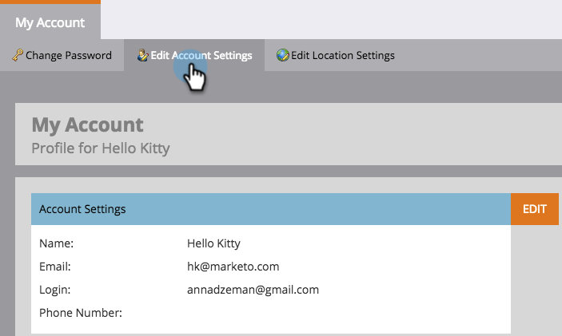

# Edit Account Settings {#edit-account-settings}

Need to change the account email address, name, or phone number? Learn how below.

>[!NOTE]
>
>**Admin Permissions Required**

1. Go to **Admin**.

   

1. Select **My Account**.

   

1. Select **Edit Account Settings**.

   

1. Make your edits and click **Save**.

   

   Ta-da! Info updated.
