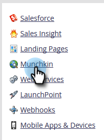

# Edit "Do Not Track" Browser Support Settings {#edit-do-not-track-browser-support-settings}

"Do Not Track" is a browser request to not be tracked in systems like Marketo. You can honor that request with the following steps.

>[!NOTE]
>
>**Admin Permissions Required**

>[!NOTE]
>
>"Do Not Track" will be set to Ignore by default, so if that's what you want, you won't need to take any steps.

1. Click **[!UICONTROL Admin]**.

   

1. Click **[!UICONTROL Munchkin]**.

   

1. Under **[!UICONTROL Person Tracking]**, click **[!UICONTROL Edit]**.

   

1. Select **[!UICONTROL Support]** and click **[!UICONTROL Save]**.

   

   After saving the changes, you'll see the update.

   

   >[!NOTE]
   >
   >Best practice is to support the "Do Not Track" feature. In Europe, it's the law!

   >[!TIP]
   >
   >To learn more about "Do Not Track" and how it works, please visit [this page](https://en.wikipedia.org/wiki/Do_Not_Track).
