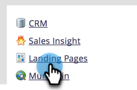
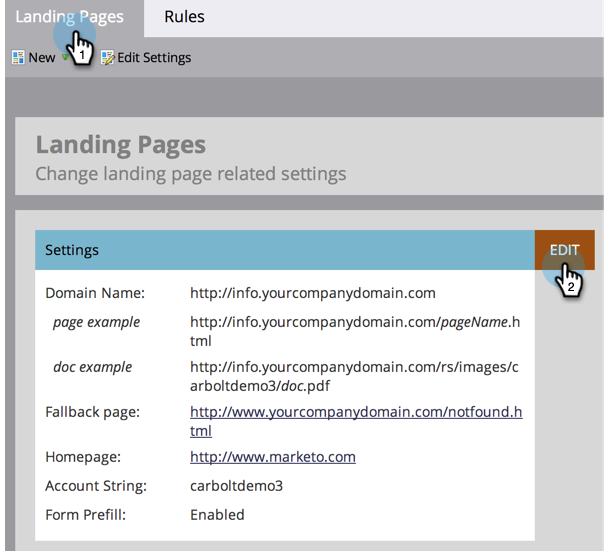
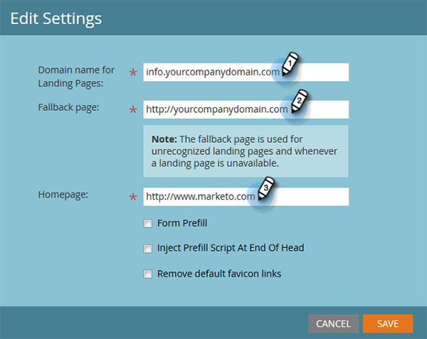
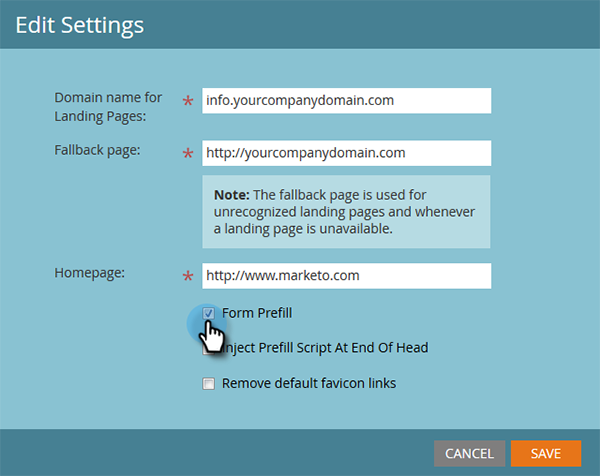

# Edit Landing Page Settings {#edit-landing-page-settings}

You can edit your domain name and fallback page, enable or disable form prefill, prevent misuse of your landing page, and more. Here's how.

>[!NOTE]
>
>**Admin Permissions Required**

1. Go to the **Admin** area. 

   

1. Click **Landing Pages**.

   

1. In the **Landing Pages** section, click **Edit**.

   

1. Enter your domain and page information.

   

   | Term |Definition |
   |---|---|
   | Domain name for landing pages |This is your CNAME. A CNAME is the first part of the URL you give people for landing pages. For example, in `https://go.yourCompany.com`, the word "go" is the CNAME. You can have multiple, but most people just use the one. |
   | Fallback page |This is where to go if the landing page doesn't exist or is down. Learn more about [fallback pages](/help/marketo/product-docs/administration/settings/set-a-fallback-page.md). |
   | Homepage |Enter your corporate site URL. |

1. Check the **Form Prefill** checkbox to allow forms to prefill information for known (cookied) people. Uncheck to block.

   

1. If you want to prevent a malicious site from seemingly hosting your content, check the **Do not allow Marketo pages to be embedded in external web pages** checkbox.

   

   >[!NOTE]
   >
   >If you want the prefill `<script>` tag to appear at the end of the `<head>` tag in the code, check the **Inject Prefill Script at End of Head** box. Leave unchecked if you want it to appear at the beginning.
   >
   >Check **Remove default favicon links** to prevent Marketo from inserting any favicon links into the code.

1. After making your selections, click **Save.**

   

   Great job! Your landing pages now have the right information and should start working right away.
