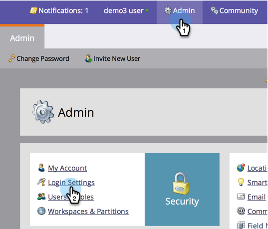

# Edit Link Expiration in Reports and Alerts {#edit-link-expiration-in-reports-and-alerts}

##### Links in your report subscription emails expire after three days. In order to change the expiration time for these links, follow these steps.  {#links-in-your-report-subscription-emails-expire-after-three-days-in-order-to-change-the-expiration-time-for-these-links-follow-these-steps}

>[!NOTE]
>
>**Admin Permissions Required**

1. Under **Admin**, click **Login Settings**. 

   

1. Click **Edit URL Expiration**. 

   

1. In the drop-down, select the number of days before the link expires. Click **Save**. 

   

Cool, you have edited your email link expiration settings.

>[!NOTE]
>
>**Reminder**
>
>Remember, these only apply to links in reports and alerts, not marketing emails.

