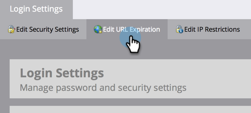

# Edit Link Expiration in Reports and Alerts {#edit-link-expiration-in-reports-and-alerts}

Links in your report subscription emails expire after three days. To change the expiration time for these links, follow these steps.

>[!NOTE]
>
>**Admin Permissions Required**

1. Go to the **[!UICONTROL Admin]** section.

   

1. Click **[!UICONTROL Login Settings]**.

   

1. Click **[!UICONTROL Edit URL Expiration]**.

   

1. In the drop-down, select the number of days before the link expires. Click **[!UICONTROL Save]**.

   

>[!IMPORTANT]
>
>This setting only applies to links in reports and alerts. It does **not** apply to the emailed [download report](/help/marketo/product-docs/reporting/basic-reporting/report-subscriptions/subscribe-to-a-smart-list.md#email-message) link or marketing emails.
