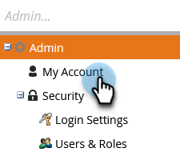

# Edit Subscription Settings {#edit-subscription-settings}

If you have access to multiple Marketo subscriptions and want to be sure which one you're using, try giving each one a unique name. That name then displays at the top of your subscription page.

For example, if you work in both production and sandbox instances, you can name one subscription **Marketo Production** and the other **Marketo Sandbox**.

1. Go to **[!UICONTROL Admin]**.

   

1. Click **[!UICONTROL My Account]**.

   

1. Click **[!UICONTROL Edit Subscription Information]**.

   

1. Make your edits and click **[!UICONTROL Save]**.

   
