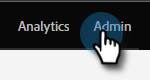
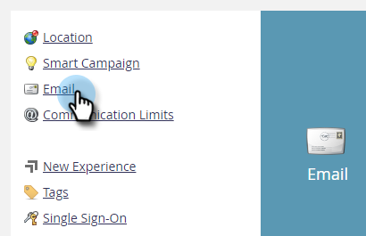

# Email Tracking Link Headers {#email-tracking-link-headers}

Follow the steps below to customize your email tracking link headers.

1. In Marketo, click **Admin**.

   

1. Click **Email**.

   

1. Scroll down to Custom Header Options. Choose your desired settings and click **Save Changes**.

   

<table>
 <tr>
  <td><strong>Strict-Transport-Security</strong></td>
  <td>Use this to guarantee connections to Landing Pages will always be served over HTTPS (should only be set for subscriptions with Landing Pages secured by SSL)</td>
 </tr>
</table>

>[!CAUTION]
>
>It's important to review these settings with your IT team to determine what your organization's policy should be set to. Incorrect settings can prevent some visitors from accessing your Email links.
