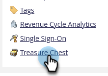
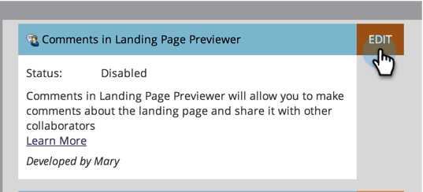

# Enable or Disable Treasure Chest Features {#enable-or-disable-treasure-chest-features}

The Treasure Chest holds fun experimental features that are not fully supported.

>[!NOTE]
>
>**Admin Permissions Required**

1. Go to the **[!UICONTROL Admin]** area.

   

1. Click **[!UICONTROL Treasure Chest]**.

   

1. Click **[!UICONTROL Edit]** for the feature you want to enable or disable.

   

1. Check the **[!UICONTROL Enabled]** box to enable, or uncheck to disable, and click **[!UICONTROL Save]**.

   

   >[!TIP]
   >
   >You may need to log out then back into Marketo to see the changes take effect.
