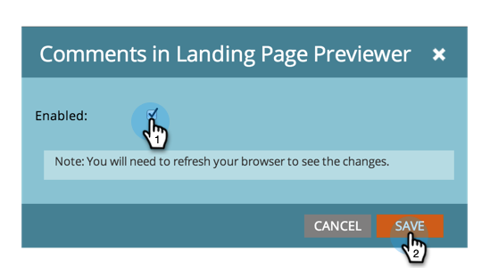

# Enable or Disable Treasure Chest Features {#enable-or-disable-treasure-chest-features}

The Treasure Chest holds fun experimental features that are not fully supported.

>[!NOTE]
>
>**Admin Permissions Required**

1. Under **Admin** click **Treasure Chest**.

   

1. Click **Edit** for the feature you want to enable or disable.

   

1. Check the **Enabled** box to enable, or uncheck to disable, and click **Save**.

   

   >[!TIP]
   >
   >You may need to log out then back into Marketo to see the changes take effect.
