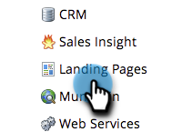

# Enable Personalized URLs for Your Account {#enable-personalized-urls-for-your-account}

Personalized URLs are great for print mail campaigns.

>[!NOTE]
>
>**Admin Permissions Required**

1. Go to the **Admin** area.

   

1. Click **Landing Pages**.

   

1. Click **Edit**.

   

1. Check the **Enable Personalized URLs** box and click **Save**.

   

Great job! Now that you have enabled PURLs for your account, you can [enable them for individual landing pages](/help/marketo/product-docs/demand-generation/landing-pages/personalizing-landing-pages/enable-personalized-urls-for-a-landing-page.md).

>[!NOTE]
>
>If there are two people with the same First/Last name, the system will automatically append a number to the end.
