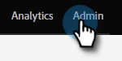
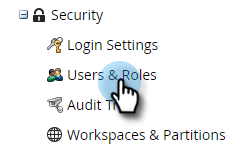
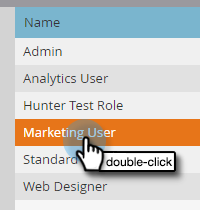
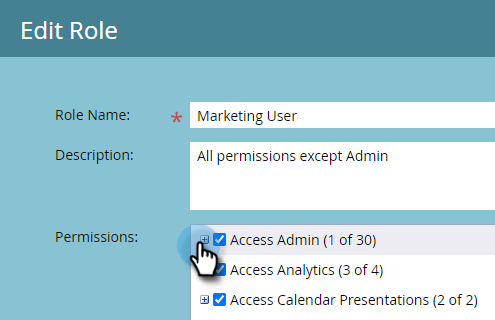
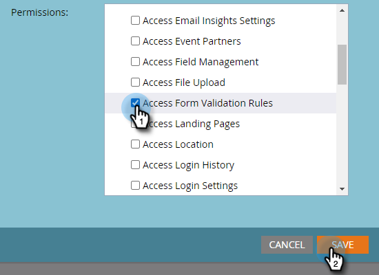
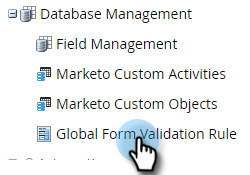
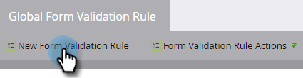
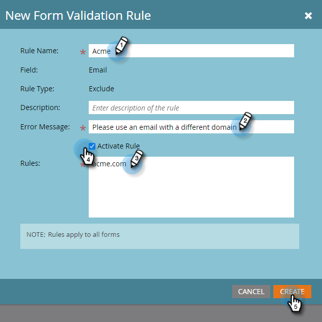
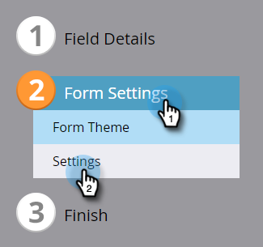
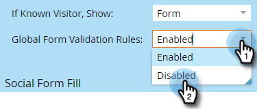

# Global Form Validation Rules {#global-form-validation-rules}

This feature allows you to block specific domains from submitting to Marketo Engage forms.

## How to Enable Access {#how-to-enable-access}

Before you can utilize this feature, you must enable its permssion per desired role.

1. In Marketo, click **Admin**.

   

1. Click **Users & Roles**.

   

1. Click the **Roles** tab.

   

1. Double-click the role you'd like to grant permissions to.

   

1. Click the **+** sign next to Access Admin.

   

1. Scroll down and select **Access Form Validation Rules** and click **Save**.

   

## Create New Form Validation Rule {#create-new-form-validation-rule}

>[!IMPORTANT]
>
>These rules will apply to all forms in your Marketo Engage subscriptions.

1. In Marketo, click **Admin**.

   

1. Click **Global Form Validation Rule**.

   

1. Click **New Form Validation Rule**.

   

   >[!NOTE]
   >
   >The Form Validation Rule Actions drop-down allows you to delete or edit existing rules.

1. Name your rule, give it an optional description, and enter the error message you want your form visitors to see. Enter the domain(s) you want blocked in the rules box, select **Activate Rule**, and click **Create**.

   

>[!NOTE]
>
>Marketo Engage has a defined blocklist of free consumer email domains that are blocked when using our pre-loaded "Consumer Email Domain Blocklist" rule. [View that list here](/help/marketo/product-docs/administration/settings/assets/freemaildomains_2023.csv).

## How to Disable Access Per Form{#how-to-disable-access-per-form}

Once enabled, rules apply to all forms. If you have a form with specific requirements, however, and you don't want anything rejected, you can disable Global Form Validation Rules in the form's settings.

1. In your desired form, click **Form Settings**, then **Settings**.

   

1. Click the Global Form Validation Rules drop-down and choose **Disabled**.

   

When you approve and post your form, it will ignore your Global Form Validation Rules.
