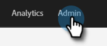
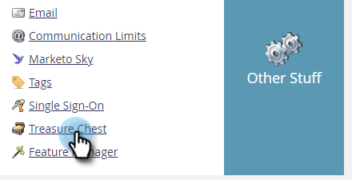
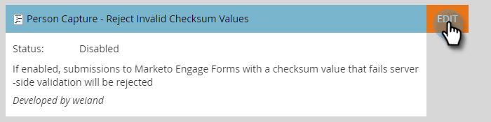
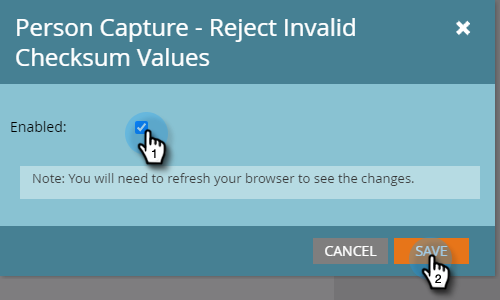

# How to Block Spam Form Submissions {#how-to-block-spam-form-submissions}

Often, form submissions with an invalid or missing checksum (usually from bots) can produce false statistics. Here's how to prevent that.

>[!CAUTION]
>
>This feature rejects form submissions made using programmatic POSTs to the leadCapture/save2 endpoint. If your business utilizes an integration that submits forms to Marketo with that method, enabling this feature will block those submissions. Using leadCapture/save2 as an API or performing programmatic form submissions directly to it is unsupported as well as forbidden. Please ensure your business only submits forms using: Form assets, embedded forms code, Forms2.js API, or the Submit Form REST API.

1. Click **Admin**.

   

1. Click **Treasure Chest**.

   

1. Next to **Person Capture - Reject Invalid Checksum Values**, click **Edit**.

   

1. Select the **Enabled** checkbox and click **Save**.

   

>[!NOTE]
>
>Upon enabling this feature, you may see a drop in form activity as false numbers get filtered out.
