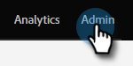
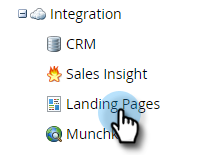
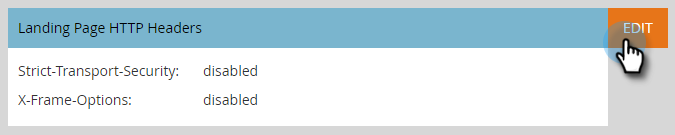
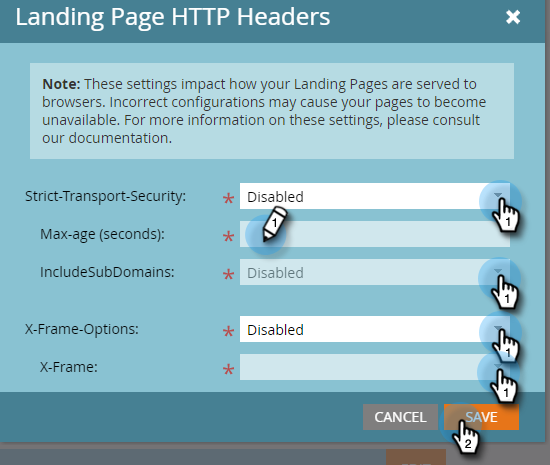

# Landing Page Headers {#landing-page-headers}

Follow the steps below to customize some of the HTTP headers on your Landing Page domains.

1. In Marketo, click **Admin**.

   

1. Click **Landing Pages**.

   

1. Click **Edit** next to Landing Page HTTP Headers.

   

1. Choose your desired settings and click **Save** when done.

   

<table>
 <tr>
  <td><strong>Strict-Transport-Security</strong></td>
  <td>Use this to guarantee connections to Landing Pages will always be served over HTTPS (should only be set for subscriptions with Landing Pages secured by SSL)</td>
 </tr>
 <tr>
  <td><strong>X-Frame-Options</strong></td>
  <td>Lets you define whether or not Marketo Engage hosted assets can be embedded in external web pages</td>
 </tr>
</table>

>[!CAUTION]
>
>It's important to review these settings with your IT team to determine what your organization's policy should be set to. Incorrect settings can prevent some visitors from accessing your Landing Pages.
