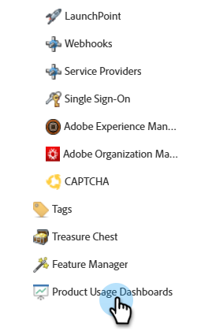
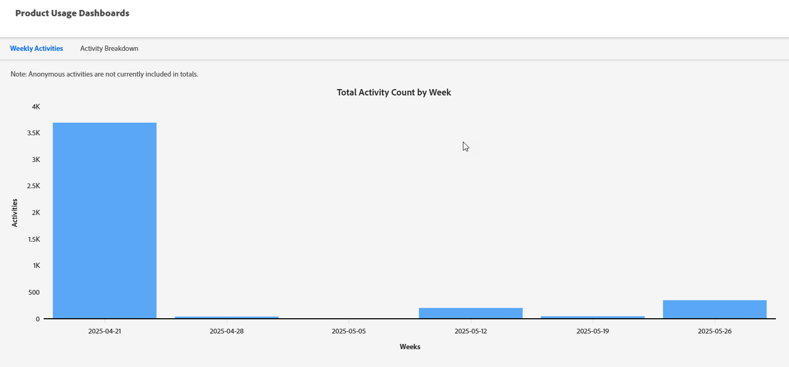

# Product Usage Dashboards {#product-usage-dashboards}

Marketo Engage Product usage dashboards provide the ability to view product and platform usage against certain limits or backlog of data through-put, usage against daily quota, and key metrics on a subscription. Infrastructure is allocated to provide performance limits defined for Product levels for particular attributes. Some of these limits, like API usage, are contracted limits purchased as part of your package or Product Tier. 

## How to Access {#how-to-access}

1. In Marketo Engage, click **Admin**.

   

1. In the tree on the left, scroll down and select **Product Usage Dashboards**.

   

## Activity Usage Dashboard {#activity-usage-dashboard}

### Average Weekly Activities {#average-weekly-activities}

The Weekly Activity Usage dashboard provides a weekly count of Activity Types over a rolling 52-week period. Weekly activities produced are a good indicator of how much marketing you're doing in Marketo Engage. Activities serve as a proxy for the various system processes and trackable events that take place within Marketo.

Activity Types include both counts of activities captured when people that interact with marketing events as well as system-based activities triggered by Flow Actions. Some examples of person-initiated activities are when a person opens an email, or clicks on a link in an email. An example of system-based activities triggered by a Flow Action is "Send to SFDC" when the trigger is initiated. To view a count of activity types for a particular week, hover over a week and view the count.

{width="800" zoomable="yes"}

#### FAQ {#faq}
 
**Which Activity Types are counted?**

It's contingent upon what activities are included in the pipeline.

**Is both known and anonymous lead/person activity included?**

Only known people/leads.

**How often is the data refreshed?**

Activity counts are refreshed every morning.

## Activity Breakdown {#activity-breakdown}

Here we get counts of activities over the previous seven days based on meaningful slices of the data. Group activities by the most common activity types seen in the last seven days. This may include categories like "Change Data Value," "Add to List," or "Send Email." This lets you see what types of activities are happening most often in the system. Activity Type usage is a key indicator of determining growth, or if optimizations are needed to reduce usage.

>[!NOTE]
>
>* All the breakdowns below are a "rolling seven-day" sum and do **not** include the current day. So think of it as "yesterday + six days before that."
>
>* The dashboard only shows the top 20 activity types, while the rest are sorted into a category titled "Other."

{width="800" zoomable="yes"}
 
Activity usage is a key indicator of how much marketing is being conducted, and helps visualize growth against identified for the level of product contracted for. Dashboards can also be used as a guide to determine how much optimization can/should be done by reducing the fields being updated.

### By Type {#by-type}

Group activities by the most common activity types seen in the last seven days. This may include categories like _Change Data Value_, _Add to List_, or _Send Email_. This lets you see what types of activities are happening the most often in Marketo Engage.

### By Change Data Value Attribute {#by-change-data-value-attribute}

_Change Data Value_ is the most common activity type. It indicates when a piece of information on a person/lead record is updated. Here, we group by the fields that are changed most often so you can determine if what information is useful for your marketing operations, if there are opportunities to optimize platform usage, etc.

### By Campaign {#by-campaign}

Group by which campaigns are producing the most activities. This offers insight to see if you any particularly "noisy" campaigns that create more activity than necessary. Quickly learn about campaigns that should be decommissioned, or campaigns that are doing more work than intended.

### By Source (COMING SOON) {#by-source}

Group by the source of the activities (_CRM Sync_, _Campaign Flow Action_, _API Upload_, _Landing Page Form Fill_, etc.). This helps you understand if most of your activities are being produced by marketing actions, CRM syncs, or by the people/leads themselves.
