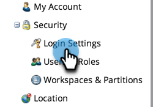
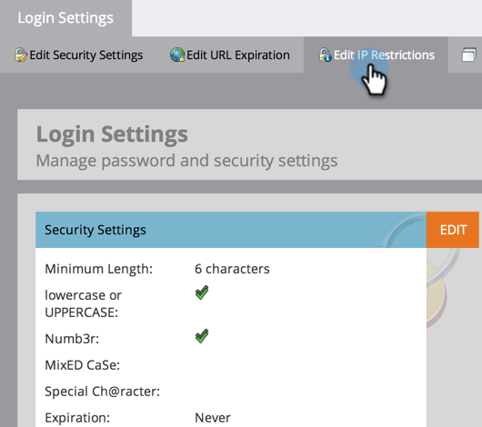

# Restrict Marketo Logins Based on IP {#restrict-marketo-logins-based-on-ip}

You can restrict or enable users from accessing Marketo based on their IP addresses. Here's how.

>[!NOTE]
>
>**Admin Permissions Required**

>[!NOTE]
>
>The information in this article only applies to direct log-ins at login.marketo.com. It is not possible to enforce IP restrictions on single sign-on (SSO) log-ins at this time.

1. Go to the **[!UICONTROL Admin]** area.

   

1. Click **[!UICONTROL Login Settings]**.

   

1. Click **[!UICONTROL Edit IP Restrictions]**.

   

1. Choose whether you want to **Allow** or **Block** specific addresses, enter the address(es), then click **[!UICONTROL Save]**.

   >[!NOTE]
   >
   >**Definition**
   >
   >* **[!UICONTROL Allowed IP addresses]**: Adding allowed IP addresses is inclusionary. It will include all of the IP addresses specified and exclude everything else.
   >* **[!UICONTROL Block IP addresses]**: Prevents specific IPs from accessing Marketo.
   >* **[!UICONTROL Disable IP Restrictions]**: Checking this will stop any/all restriction rules from working. Use this for testing purposes.

   >[!NOTE]
   >
   >You can add multiple restrictions, but they can only be ALL allowed or ALL blocked. You cannot mix and match allowed and blocked.

   

   Nicely done, your marketing data is now safer than it ever was!
