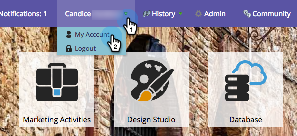
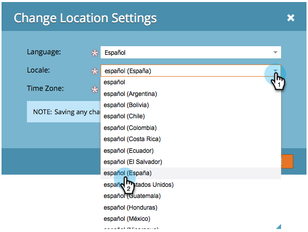
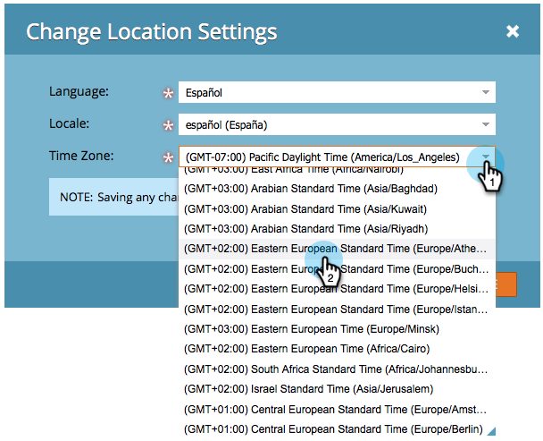
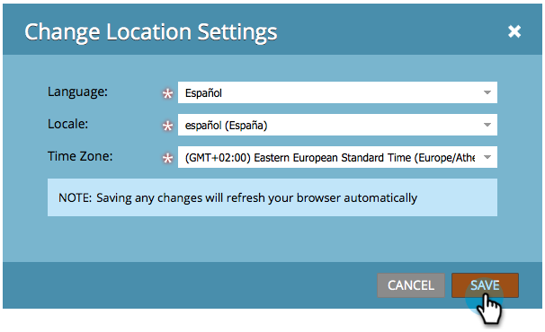
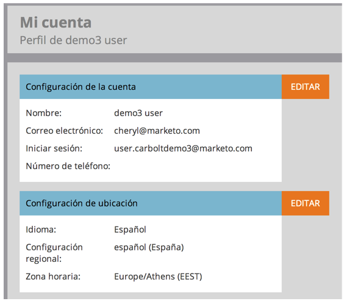

# Select Your Language, Locale and Time Zone {#select-your-language-locale-and-time-zone}

### What's in this article? {#whats-in-this-article}

[Supported Languages](#supported-languages)  
[Change User Language, Locale, and Time Zone](#change-user-language-locale-and-time-zone)  
English isn't your first language? Don't worry, we have you covered. Here's how to change your own language, locale, and time zone.

#### Supported Languages {#supported-languages}

* English
* French
* German
* Japanese
* Portuguese
* Spanish

#### Change User Language, Locale, and Time Zone {#change-user-language-locale-and-time-zone}

##### 1. Login to Marketo and under your name select My Account. {#login-to-marketo-and-under-your-name-select-my-account}

  

##### 2. Under My Account, click Edit Location Settings. {#under-my-account-click-edit-location-settings}

  

##### 3. Change your Language. {#change-your-language}

>[!TIP]
>
>You also have the option of changing just your language by clicking the language drop-down at the top of the login page.

##### 4. Change your Locale. {#change-your-locale}

  

##### 5. Change your Time zone. {#change-your-time-zone}

  

##### 6. Click Save. {#click-save}

Nice job! Your browser will refresh and you should see the changes reflected.

