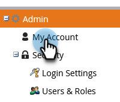
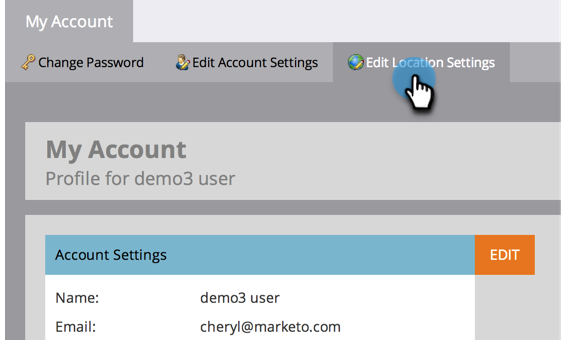
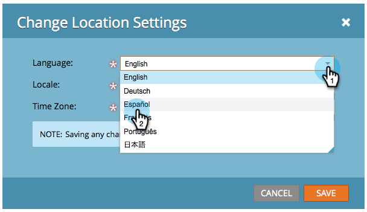

# Select Your Language, Locale and Time Zone {#select-your-language-locale-and-time-zone}

English isn't your first language? Don't worry, we have you covered. Here's how to change your own language, locale, and time zone.

## Supported Languages {#supported-languages}

* English
* French
* German
* Japanese
* Portuguese
* Spanish

## Change User Language, Locale, and Time Zone {#change-user-language-locale-and-time-zone}

1. Go to the **Admin** area.

   

1. Select **My Account**.

   

1. Under My Account, click **Edit Location Settings**.

   

1. Change your **Language**.

   

   >[!TIP]
   >
   >You also have the option of changing just your language by clicking the language drop-down at the top of the login page.

1. Change your **Locale**.

   

1. Change your **Time Zone**.

   

1. Click **Save**.

   

Nice job! Your browser will refresh and you should see the changes reflected.

