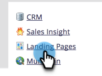
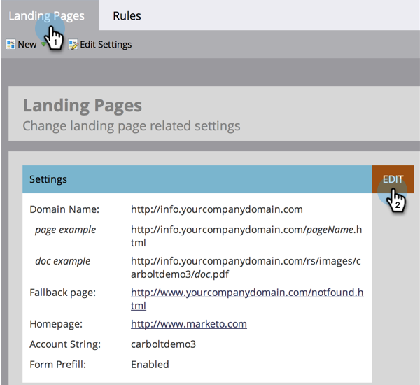
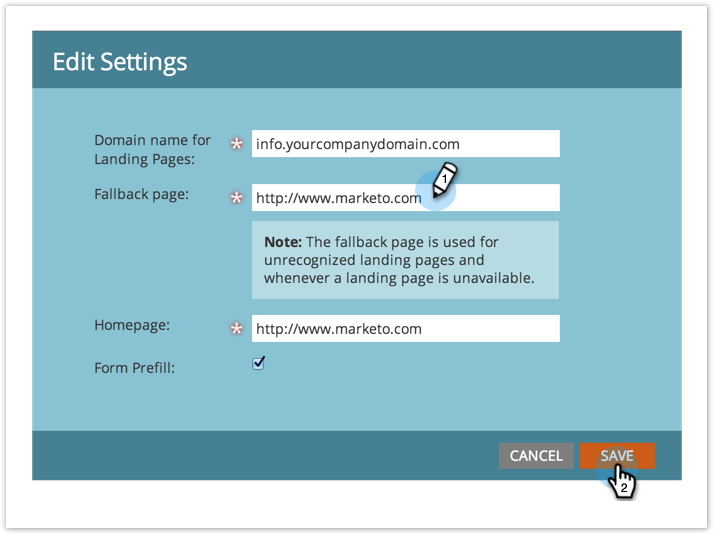

# Set a Fallback Page {#set-a-fallback-page}

Fallback pages are the last line of defense if your landing page is offline or not found. Make sure you have one.

>[!NOTE]
>
>**Admin Permissions Required**

1. Go to the **[!UICONTROL Admin]** area.

     

1. Click **[!UICONTROL Landing Pages]**.

     

1. Under the **[!UICONTROL Landing Pages]** tab, click **[!UICONTROL Edit]**.

   

1. Enter a **[!UICONTROL Fallback page]** in the dialog box and click **[!UICONTROL Save]**.

   

