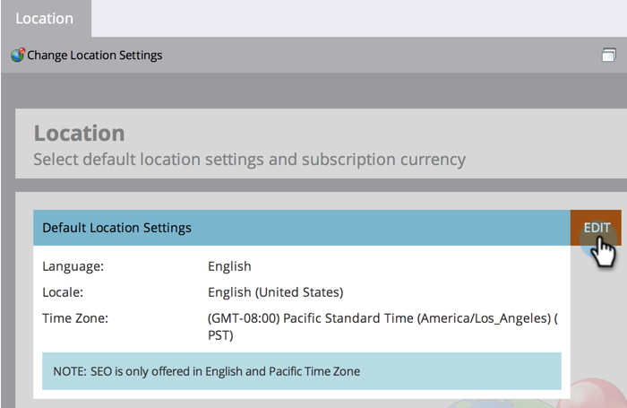
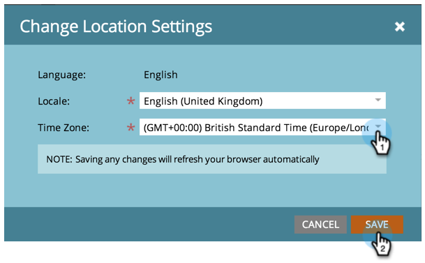

# Set Default Location Settings for a Subscription {#set-default-location-settings-for-a-subscription}

This article describes how an Admin would view and edit the default location settings for a subscription, including language, locale, and time zone.

>[!NOTE]
>
>Admin rights required. The language is not typically something that the Admin would change. It is specified at the time of purchase so that the subscription can be generated in the appropriate language.

## Set Default Location Settings for a Subscription {#set-default-location-settings-for-a-subscription-1}

When an Admin changes the default location settings, newly created users inherit these settings. Users can always [change their language, locale, and time zone preferences](/help/marketo/product-docs/administration/settings/select-your-language-locale-and-time-zone.md) in their individual accounts.

1. Go to the **[!UICONTROL Admin]** area.

   

1. Click **[!UICONTROL Location]**.

   

1. Click **[!UICONTROL Edit]**.

   

   This subscription was created in English. Let's say you were in London and wanted to change the default locale and time zone. The locale determines the formatting for numbers, dates, and times.

1. Select the **[!UICONTROL Locale]** and change it to **[!UICONTROL English (United Kingdom)]**.

   

1. Finally, choose the appropriate **[!UICONTROL Time Zone]**.

   

   >[!NOTE]
   >
   >Marketo Sales Insight for [Salesforce.com](https://salesforce.com/) supports French, German, Japanese, Portuguese, and Spanish.

## Set the Default Currency Settings for a Subscription {#set-the-default-currency-settings-for-a-subscription}

If you are changing the default locale for your users, you may also want to change the currency format settings.

1. Click **[!UICONTROL Edit]** in [!UICONTROL Subscription Currency Settings].

   

1. Select the currency format of your choice and click **[!UICONTROL Save]**.

   

   Congratulations! You have changed your location settings for the subscription.

>[!MORELIKETHIS]
>
>* [Select Your Language, Locale and Time Zone](/help/marketo/product-docs/administration/settings/select-your-language-locale-and-time-zone.md)
