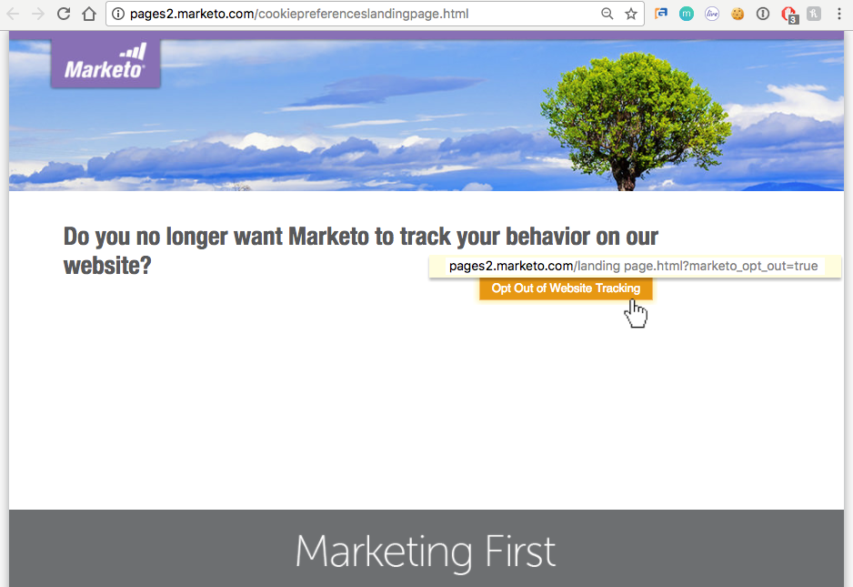
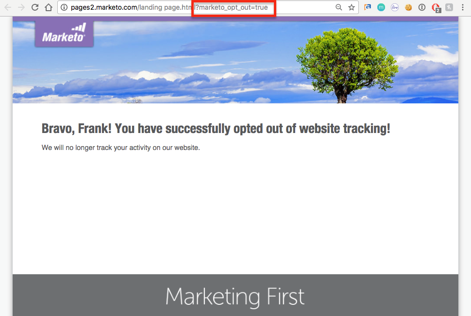

# Understanding Privacy Settings {#understanding-privacy-settings}

## Overview {#overview}

Marketo provides marketers with a way to get web visitors' consent to track them. There are two ways to opt out, or you can choose to be tracked by anonymized IP.

* Web visitors select the Do Not Track (DNT) feature in their browser (and the marketer honors the web visitor's request for Do Not Track)
* Web visitors use an opt out cookie provided by a marketer on a website

Or, the marketer can track users, but use an anonymized IP.

These methods might affect Marketo’s value and functionality in specific areas. However, if the marketer *doesn’t* change anything in Marketo's configuration, Marketo functionality remains the same.

## Browser Settings for Do Not Track {#browser-settings-for-do-not-track}

Web visitors can set their browser to prevent tracking by any website by choosing "Do Not Track" (DNT). This prevents tracking for this particular browser and device. See the browser's privacy settings for complete details.

In Munchkin, a marketer can [decide whether to support or ignore the browser's DNT setting](/help/marketo/product-docs/administration/settings/edit-do-not-track-browser-support-settings.md).

In Web Personalization, a marketer can decide whether to [support or ignore the browser's DNT setting](/help/marketo/product-docs/web-personalization/getting-started/setting-web-personalization-to-do-not-track.md).

## Opt Out from a Specific Website {#opt-out-from-a-specific-website}

You can also allow site visitors to opt out of website tracking from your website, regardless of whether or not **Browser Do Not Track** settings are configured. This allows the site visitor to specify their tracking preferences directly from your website.

In order to do this, you must add a parameter to an opt out link on a webpage that has munchkin tracking enabled. This can be any webpage, but the webpage link must contain the following parameter:

?marketo_opt_out=true

Below are examples of a webpage with an opt-out link and a landing page for after the link is clicked. Yours will vary.

Here's a webpage with a button with the “?marketo_opt_out=true” parameter in the opt-out link.

You can create and publish a landing page as a follow-up page for when your link with the “?marketo_opt_out=true” parameter is clicked.

When the link is clicked, Marketo adds a cookie called **mkto_opt_out** to the visitor's browser that disables Munchkin tracking for the site visitor who clicks the link with the above parameter.

To validate that the cookie can be planted, verify that you are a cookied lead and click the link. Then check your browser cookies to verify that the **mkto_opt_out** cookie was added.

>[!NOTE]
>
>This currently works only with Munchkin versions 152 and above.

## Opt In {#opt-in}

Marketers can enable users to opt in by using Marketo's capabilities in emails, forms, landing pages, and other methods.

## Tracking Using an Anonymized IP {#tracking-using-an-anonymized-ip}

Marketers can preserve privacy by tracking users with an anonymized IP address. To do that, add this code to the RTP or Munchkin Javascript that's embedded in the website.

* For Munchkin, just add {"anonymizeIP",true} to the init function.

  >[!NOTE]
  >
  >Use of this parameter requires that Munchkin V2 be enabled. To get it enabled for your subscription, please contact [Marketo Support](http://nation.marketo.com/community/support_solutions).

* For Web Personalization (RTP), add this to the javascript:

`anonymize IP : before calling rtp('send','view'); add rtp('set', 'settings', {'anonymizeIP' : true});`
