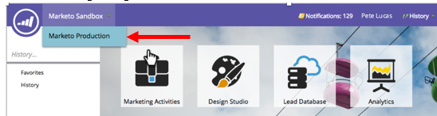

# Using a Universal ID for Subscription Login {#using-a-universal-id-for-subscription-login}

A Universal ID lets you access multiple Marketo subscriptions with a single login, and switch between subscriptions quickly. However, you can use different logins for your subscriptions if you'd like.

With Universal ID, you still create support tickets for each of your individual subscriptions.

Subscription level settings are honored for users who are using Universal ID, for example, roles, permissions, and password policies. User profile level changes are reflected in all subscriptions, for example, first name, last name, and email address.

## Setting Up a Universal ID {#setting-up-a-universal-id}

From each individual instance, your Marketo admin must invite you to each of your different subscriptions with the same login. Marketo can't merge your existing logins automatically. Once you enable Universal ID, **your Marketo instance will be unavailable** for up to 30 minutes. If you have a larger user base, it could be a bit longer.

>[!CAUTION]
>
>If Single ID or Universal ID is enabled for a user, their roles and workspaces can **not** be edited after their initial set up.

>[!NOTE]
>
>If you have multiple subscription login IDs, you may also have multiple community profiles. Be sure to choose the ID for your Universal ID that's connected to the profile that you want to use, and that's for your production instance, not your sandbox.

## Logging In {#logging-in}

When you log in to accept an invitation to a second subscription using a Universal ID, you'll see the Opt-in login page. Here, you must check a checkbox to accept the terms and conditions. After you've accepted, you'll see the normal reset page, not this one, for any subsequent logins. By accepting the terms and conditions, you are allowing Marketo to distribute your basic profile data (such as first name, last name, and email address) to the datacenters in different locations where your subscription is hosted.

>[!TIP]
>
>IDs you no longer use remain unless the subscription admin deletes them. We recommend that you keep them, in case, for example, you have a private report, assigned to yourself, that can only be accessed using that ID. In this case, it makes sense to move these private reports to your new Universal ID and then delete your existing ID.

## Passwords {#passwords}

With Universal ID for multiple subscriptions, Marketo automatically enforces the most stringent password policy. For example, if some subscriptions require a minimum password length and others don't, the minimum length will be enforced for all subscriptions.

With a Universal ID for multiple subscriptions, only you can change the password.

>[!NOTE]
>
>Marketo will ask users who want to use Universal ID to reset their password if the current subscription’s password doesn't comply with the password policy of the second subscription to which they are being invited.

## Switching Between Subscriptions {#switching-between-subscriptions}

Using a Universal ID, you can see the subscription you're logged into, and select other subscriptions to which you have login access. In most cases, you can switch between them without having to log out and back in. 

When you log out and back in, Marketo automatically logs you into the subscription you were last logged into. You can then switch to a different subscription if necessary.

## Community Profiles {#community-profiles}

If you have multiple subscriptions, you may have multiple community profiles. We recommend that you choose the login that's linked with your most active community profile. 

## Mobile Platform {#mobile-platform}

Users with Universal ID can see their data on Marketo Moments and the iPad event check-in application from the subscription that they have last logged into. You can't change subscriptions from the Mobile platform itself.

