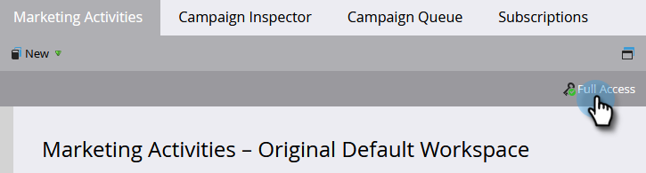
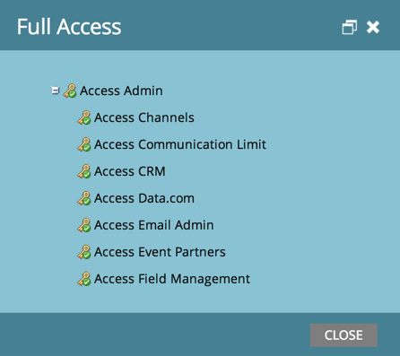

# Find Out What Permissions You Have {#find-out-what-permissions-you-have}

If you're wondering what permissions you have or don't have in Marketo, there's an easy way for you to find out.

1. Go to **[!UICONTROL Marketing Activities]**.

   

1. Click **[!UICONTROL Full Access]** to see the permissions you have.

   

You'll see the permissions listed out.

   

   If you need any of the permissions enabled for you, speak to your Marketo administrator.
